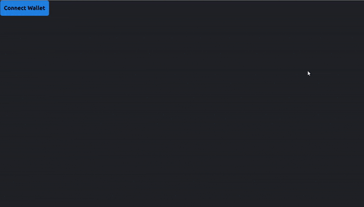
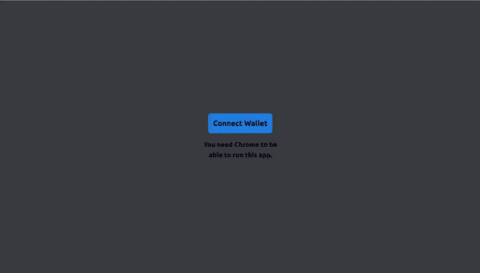
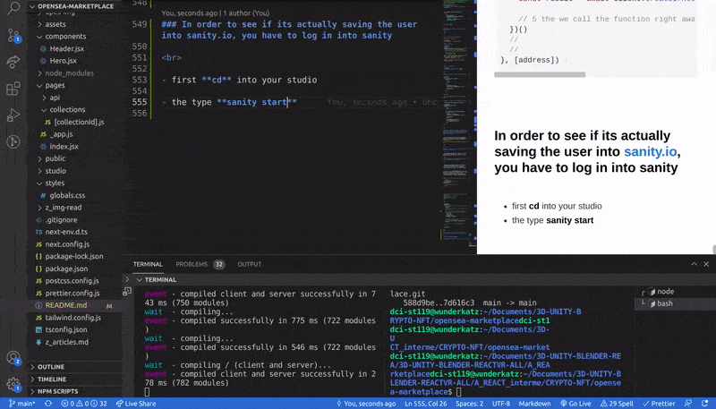
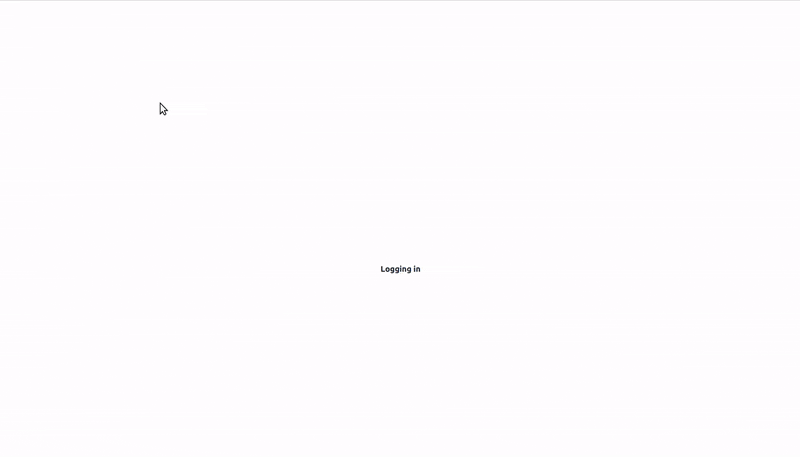
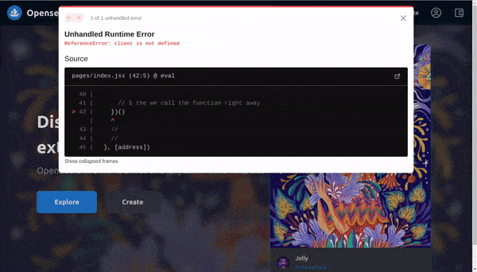

[](https://emoji.gg/emoji/8285-puppycat-pose)

## Build OpenSea Blockchain Web 3.0 App with Next.js | Sanity.io | thirdweb

#### [check the video tutorial here](https://youtu.be/x3eRXeMB-4k)

<br>

#### Check this other tutorial for more details on this <u>Topic</u>

##### [Build your own NFT marketplace like OpenSea clone with solidity,openzeppelin and polygon (SUBSCRIBE)](https://youtu.be/7Q5E6RvLlUw)

<br>

---

<br>

# Docs

> **Blockchain development:** Smart Contracts, security, IDE, Truffle & hardhat, Etherscan, Dapp | **NFT:** ERC's ... [all here](./z_articles.md) ✋

<br>
<br>

## Interesting articles & links:

##### How to make money with NFT as a developer?

[How to make money with NFT as a developer?](https://youtu.be/5_Wu_X4LnAw)

<br>

##### NFT Marketplaces

> NFT marketplace rankings and analysis. Find non-fungible token trading volumes, number of traders per NFT marketplace and more key metrics.

[NFT Marketplaces](https://dappradar.com/nft/marketplaces) ✋

<br>

---

<br>

# Login:

#### Login in Metamask : [metamask](https://metamask.io/)

#### Login in ThirdWeb : [Thirdweb](https://bit.ly/3EJLftx)

#### Login [Opensea](https://testnets.opensea.io/)

 <br>

---

<br>
<br>

# 🌈

## Hero component

- Create the **Hero.js** inside the **components folder**, then import it inside the **pages/index**

<br>

##### [Hero styles](https://drive.google.com/drive/folders/1BS_tG_B7kH3pJVBu6KJiLgsk4T2gt9Jr)

<br>

#### So here there is nothing ordinary, only the tailwind part but if you know about css, you understand what is happeing.

- for example: it has a position relative, it s relative also the wrapper, than the fontsize is at 46px etc

<br>

- this [rounded-full](https://tailwindcss.com/docs/border-radius) on the images is a **border-radius**

<br>

- **h-screen** height: 100vh;

```javascript
import React from 'react'

//

// Hero.js
const style = {
  wrapper: `relative`,
  //BACKGROUND IMAGE and opacity, but keep in mind that another color is inside the styles/globals.css
  //this is a div behind the one with the text and the img, that is why here below you have the before:absolute
  container: `before:content-[''] before:bg-red-500 before:absolute before:top-0 before:left-0 before:right-0 before:bottom-0 before:bg-[url('https://lh3.googleusercontent.com/ujepnqpnL0nDQIHsWxlCXzyw4pf01yjz1Jmb4kAQHumJAPrSEj0-e3ABMZlZ1HEpJoqwOcY_kgnuJGzfXbd2Tijri66GXUtfN2MXQA=s250')] before:bg-cover before:bg-center before:opacity-30 before:blur`,
  //
  contentWrapper: `flex h-screen relative justify-center flex-wrap items-center`,

  //
  copyContainer: `w-1/2    `,

  //
  title: `relative text-white text-[46px] font-semibold`,
  description: `text-[#8a939b] container-[400px] text-2xl mt-[0.8rem] mb-[2.5rem]`,
  ctaContainer: `flex`,
  accentedButton: ` relative text-lg font-semibold px-12 py-4 bg-[#2181e2] rounded-lg mr-5 text-white hover:bg-[#42a0ff] cursor-pointer`,
  button: ` relative text-lg font-semibold px-12 py-4 bg-[#363840] rounded-lg mr-5 text-[#e4e8ea] hover:bg-[#4c505c] cursor-pointer`,
  //
  //img large -----------
  cardContainer: `rounded-[3rem] bg-cyan-500 shadow-lg shadow-cyan-500/50`,
  //
  //https://tailwindcss.com/docs/box-shadow-color
  //
  infoContainer: `h-20 bg-[#313338] p-4 rounded-b-lg flex items-center text-white`,
  author: `flex flex-col justify-center ml-4`,
  name: ``,
  infoIcon: `flex justify-end items-center flex-1 text-[#8a939b] text-3xl font-bold`,
}
//
//

const Hero = () => {
  return (
    <div className={style.wrapper}>
      <div className={style.container}>
        {/*  */}
        <div className={style.contentWrapper}>
          <div className={style.copyContainer}>
            <div className={style.title}>
              Discover, collect, and sell extraordinary NFTs
            </div>
            <div className={style.description}>
              OpenSea is the world&apos;s first and largest NFT marketplace
            </div>
            <div className={style.ctaContainer}>
              <button className={style.accentedButton}>Explore</button>
              <button className={style.button}>Create</button>
            </div>
          </div>
          <div className={style.cardContainer}>
            {/* 
              
              Big image
              
              
              */}
            
            <div className={style.infoContainer}>
              {/* 
                
                
                img avatar 
                
                
                */}

              

              {/* 
              
              
              
              */}
              <div className={style.author}>
                <div className={style.name}>Jolly</div>
                <a
                  className="text-[#1868b7]"
                  href="https://opensea.io/assets/0x495f947276749ce646f68ac8c248420045cb7b5e/2324922113504035910649522729980423429926362207300810036887725141691069366277"
                >
                  hola-kanola
                </a>
              </div>
            </div>
          </div>
        </div>
      </div>
    </div>
  )
}

export default Hero
```

<br>
<br>

#### Now lets get rid of the ugly x direction bar from the bottom of the page

[]()

- Go to the **styles** folder and inside the **globals.css**

```css
html,
body {
  background-color: #202225;
  padding: 0;
  margin: 0;

  overflow-x: hidden; ✋
}

a {
  color: inherit;
  text-decoration: none;
}

* {
  box-sizing: border-box;
}
```

<br>

#### He didnt add the overflow-x:hidden , but i had to because with the setting above, the bars remained.

[]()

<br>
<br>

# 🍨

# Authentication ✋

<br>

### Now we will need to add our metamask <u>authetication</u>

<br>

#### [Add a connect wallet button to your website](https://portal.thirdweb.com/guides/add-connectwallet-to-your-website)

##### [Metamask authentication in NextJS with Third Web](https://dev.to/byteslash/metamask-authentication-in-nextjs-with-third-web-55ff)

<br>
<br>

- Start by importing **3web**

> import { ThirdwebWeb3Provider } from '@3rdweb/hooks'

<br>

- Then **install it** ✋

```javascript
yarn add @3rdweb/hooks

// OR

npm i @3rdweb/hooks

```

#### You should have the following inside the package.json (that is not in the studio)

```javascript
  "dependencies": {
    "@3rdweb/hooks": "^1.9.2", ✋
    "next": "latest",
    "react": "^17.0.2",
    "react-dom": "^17.0.2",
    "react-icons": "^4.3.1"
  },
```

<br>
<br>

```javascript
import '../styles/globals.css'
import { ThirdwebWeb3Provider } from '@3rdweb/hooks'
//
//

function MyApp({ Component, pageProps }) {
  return (
    <>
      <Component {...pageProps} />
    </>
  )
}

export default MyApp
```

<br>

#### Once installed, lets build the chain

<br>

## The chain network

- **4** mean its **Rinkeby Testing network** , check it out: [Network ID and chain ID](https://besu.hyperledger.org/en/stable/Concepts/NetworkID-And-ChainID/)

<br>
<br>

# 🥭

### Now we need to wrap the app in our <u>ThirdwebWeb3Provider</u> provider

- so that we can access the it from every component

```javascript
import '../styles/globals.css'
import { ThirdwebWeb3Provider } from '@3rdweb/hooks'
//

/**
 * The chain ID 4 represents the Rinkeby network (read more in the branch and here z_articles.md)
 * The `injected` connector is a web3 connection method used by Metamask
 */
const supportedChainIds = [4]
const connectors = {
  //here below we will be injecting the metamask
  injected: {},
}

//

function MyApp({ Component, pageProps }) {
  return (
    <>
      ✋{' '}
      <ThirdwebWeb3Provider
        supportedChainIds={supportedChainIds}
        connectors={connectors}
      >
        <Component {...pageProps} />✋{' '}
      </ThirdwebWeb3Provider>
    </>
  )
}

export default MyApp
```

<br>

#### Before moving on, look at the code above and think about it

<br>
<br>
<br>

# 🍉

## Now go back to the pages/index.jsx

#### import the **3web hook**

```javascript
import { useWeb3 } from '@3rdweb/hooks'
```

#### paste some styles

```javascript
const style = {
  wrapper: ``,
  walletConnectWrapper: `flex flex-col justify-center items-center h-screen w-screen bg-[#3b3d42] `,
  // Use flex-col to position flex items vertically:  https://tailwindcss.com/docs/flex-direction#column
  //
  // w-screen	width: 100vw;
  // h-screen	height: 100vh;
  //
  button: `border border-[#282b2f] bg-[#2081e2] p-[0.8rem] text-xl font-semibold rounded-lg cursor-pointer text-black`,
  //rounded-lg	border-radius: 0.5rem; /* 8px */
  //
  details: `text-lg text-center text=[#282b2f] font-semibold mt-4`,
}
```

<br>

#### pass the 3web hook

```javascript
const { address, connectWallet } = useWeb3()
```

<br>
<br>

#### Now lets add some condition to know if the user is log

```javascript
return (
  <div className={style.wrapper}>
    {address ? (
      <>
        <Header />
        <Hero />
      </>
    ) : (
      <button
        className={style.button}
        onClick={() => connectWallet('injected')}
      >
        Connect Wallet
      </button>
    )}
  </div>
)
```

#### result

[]()

<br>

### Now lets wrap the button to give it some style

- the button will be positioned at the center

```javascript
<div className={style.wrapper}>
  {address ? (
    <>
      <Header />
      <Hero />
    </>
  ) : (
    <div className={style.walletConnectWrapper}>
      {/* button  ✋*/}
      <button
        className={style.button}
        onClick={() => connectWallet('injected')}
      >
        Connect Wallet
      </button>
      {/* ✋  */}
      <div className={style.details}>
        You need Chrome to be
        <br /> able to run this app.
      </div>
    </div>
  )}
</div>
```

<br>
<br>

#### It works, but its so easy that it makes me feel weird, as if you have tried authentications with node/express etc, you know its a pain, mostly because the hashing and a never ending stuff for security..I really cant believe it

<br>

- 👍 SO its working (it didnt ask me the password because i did put it in a previous test) and you can even [log to 3web](https://thirdweb.com/dashboard) once you log in.

[]()

<br>
<br>

## Sanity

#### When the user logs in we want to add the user to the Sanity.io data base

<br>

- First thing we will do is to create a **useEffect** and it will be looking for the **[address]** , this address will occur as soon as **the user logs in**

<br>

#### the useEffect is actually going to run, if the user is not logged its not going to run

<br>

# 🦜

- Here below we are going to use an [IIFE](https://flaviocopes.com/javascript-iife/) **immediately invoked function expression**, this function is created and once its created, its called right away.

<br>

> **;(async** I was wondering about the **semi colon** before the **async** , but there is a logic for using it, check the explanation here: [What is an immediately invoked function expression?](https://youtu.be/4XOol7LEDdc) 🔴 Really interesting example.

<br>

#### So this is how it looks before adding the stuff

```javascript
// normal function
const Somefunction = () => 2
Somefunction()(
  //
  // Immediately invoked function
  () => 2
)()

/*


*/
//you must to add the semicolon to avoid issues with javascript
//this is what we will be using
;(async () => {
  // All the stuff goes here
})()
```

<br>
<br>

```javascript
useEffect(() => {
  // 1 If there is no address just return and get out
  if (!address)
    return //
    // 2 if there is, then you will do the following:
  ;(async () => {
    //
    // 3 inside of the async function, we create a user DOC, we will give it the wallet address
    const userDoc = {
      _type: 'users',
      _id: address,
      userName: 'Unnamed',
      walletAddress: address,
    }
    //
    // 4 then we tell SANITY, go ahead and create the user if "the user dont exist"
    const result = await client.createIfNotExists(userDoc)

    // 5 the we call the function right away
  })()
  //
  //
}, [address])
```

<br>
<br>

### In order to see if its actually saving the user into sanity.io, you have to log in into sanity

<br>

- first **cd** into your studio

- the type **sanity start**

> You will get this if you are successfully connected:

```javascript
✔ Checking configuration files...
⠙ Compiling...webpack built 91931173cd6cf96b911c in 19107ms
✔ Compiling...
Content Studio successfully compiled! Go to http://localhost:3333
```

<br>
<br>

- type this in your browser **http://localhost:3333**, to **open** **sanity**.

<br>

[]()

<br>

### Delete the user you created manually.

<br>

[]()

<br>

<br>
<br>

- 👍 **Log out from metamask** to see if its working **(as we are going to try to make a new user)**

#### You will be getting some errors

- 🔴 Error 0.1

```javascript
MetaMask - RPC Error: Permissions request already pending; please wait. {code: -32002, message: "Permissions request already pending; please wait."}
```

<br>

##### When I saw the error I couldnt figure out the source as I had the same code from the tutorial, So I tried to clean the code and delete the useEffect to see if I could click and log in like before, but nothing.

<br>

> ##### so i separately open metamask and logged it, ONCE i did that, i had the second error

<br>

[]()

<br>

- Its says client not defined

<br>

#### Lets create the client
