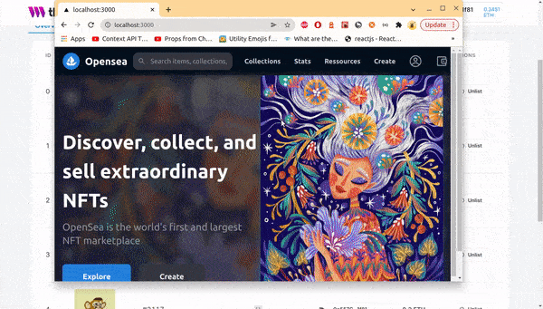
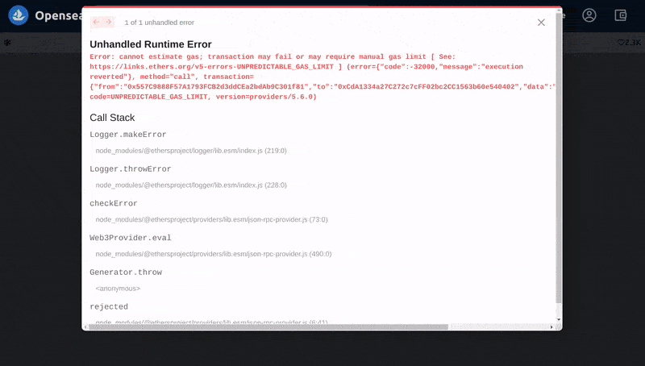
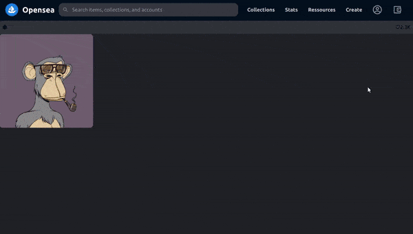
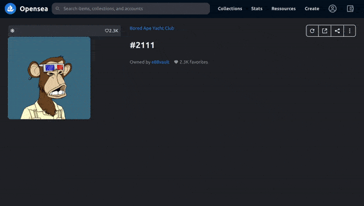
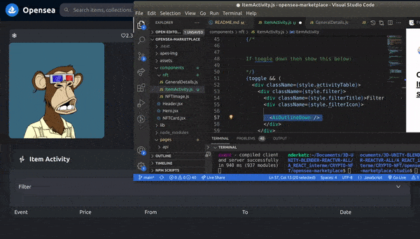
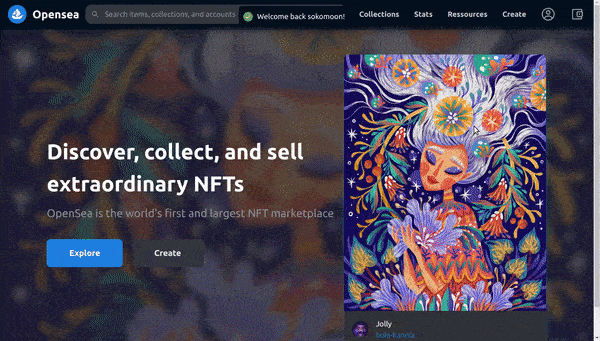
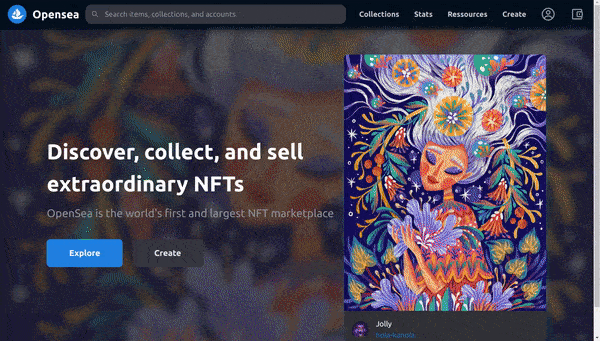

[](https://emoji.gg/emoji/8285-puppycat-pose)

## Build OpenSea Blockchain Web 3.0 App with Next.js | Sanity.io | thirdweb

#### [check the video tutorial here](https://youtu.be/x3eRXeMB-4k)

<br>

#### Check this other tutorial for more details on this <u>Topic</u>

##### [Build your own NFT marketplace like OpenSea clone with solidity,openzeppelin and polygon (SUBSCRIBE)](https://youtu.be/7Q5E6RvLlUw)

<br>

---

<br>

# Docs

> **Blockchain development:** Smart Contracts, security, IDE, Truffle & hardhat, Etherscan, Dapp | **NFT:** ERC's ... [all here](./z_articles.md) ✋

<br>
<br>

## Interesting articles & links:

##### How to make money with NFT as a developer?

[How to make money with NFT as a developer?](https://youtu.be/5_Wu_X4LnAw)

<br>

##### NFT Marketplaces

> NFT marketplace rankings and analysis. Find non-fungible token trading volumes, number of traders per NFT marketplace and more key metrics.

[NFT Marketplaces](https://dappradar.com/nft/marketplaces) ✋

<br>

##### fake eth

[faucets.chain](https://faucets.chain.link/rinkeby)

<br>

---

<br>

# Login:

#### Login in Metamask : [metamask](https://metamask.io/)

#### Login in ThirdWeb : [Thirdweb](https://bit.ly/3EJLftx)

#### Login [Opensea](https://testnets.opensea.io/)

 <br>

> **yarn dev** to start server on 3000 and in **sanity**, to start server sanity on 3333 🌵 but log into: cd studio then type **sanity start**

ok cool now how can we do it for several markets and not just one

<br>

---

<br>
<br>
<br>
 
# 🍰

<br>

## pathname: `/nfts/

<!-- []() -->

<br>

#### Here we will be creating the page related to the nft (the user will be redirected there, once the user clicks on the card)

<br>

### Go to the pages folder and create a new folder , call it 'nfts'

- inside the nfts folder we will have a file called: **[nftid].js**

<br>

- Now import the following:

```javascript
import React from 'react'
import Header from '../../components/Header'
import { useEffect, useMemo, useState } from 'react'
import { useWeb3 } from '@3rdweb/hooks'
import { ThirdwebSDK } from '@3rdweb/sdk'
import { useRouter } from 'next/router'

//
//
const style = {
  wrapper: `flex flex-col items-center container-lg text-[#e5e8eb]`,
  container: `container p-6`,
  topContent: `flex`,
  nftImgContainer: `flex-1 mr-4`,
  detailsContainer: `flex-[2] ml-4`,
}

//
//

const Nft = () => {
  return (
    <div>
      <Header />
      {/* 
      
      
      */}
      <div className={style.wrapper}>
        <div className={style.container}>
          <div className={style.topContent}>hello nft page</div>
        </div>
      </div>
    </div>
  )
}

export default Nft
```

<br>

#### now test it, lets see if when we click a nft card, we will be redirected to the correct id and also if it will mark the nft LISTED or NOT LISTED (true / false)

<br>

[]()

<br>
<br>

### The logic

- Here we will be reusing a bit the code we used for the **collections**

#### set the states and define the provider

```javascript
  //
  //

  const { provider } = useWeb3()
  // the selectedNft is the one the user will select when he clicks on it
  const [selectedNft, setSelectedNft] = useState()
  // we will get all of our listings, the listings will track the
  // the state of our listings and then will track the state of the selectedNft
  const [listings, setListings] = useState([])
  // we will get the router, because that will allow us
  // to pull the data from the url parameters and the query params
  const router = useRouter()

  //
  /*
1
- the dependency is going to be the provider,
so if the provider **dont exist** return it,
otherwise e are going to create a thirdweb
sdk: **new ThirdwebSDK**, to get our signer
**provider.getSigner()**, and we are going
to use our API key: **https://eth-rinkeby...**,
and than we are going to return the
 NFT MODULE: **sdk.getNFTModule(collectionId)**


*/
  const nftModule = useMemo(() => {
    if (!provider) return

    const sdk = new ThirdwebSDK(
      provider.getSigner(),
      'https://eth-rinkeby.alchemyapi.io/v2/oneD5PzlO3p18PfmfbguZhfsDWCUvhI2'
    )
    return sdk.getNFTModule('0xCdA1334a27C272c7cFF02bc2CC1563b60e540402')
  }, [provider])

  //
  //2 so here will be the same but this time is for the nft
  //
  // nfts **
  //
  useEffect(() => {
    if (!nftModule) return
    ;(async () => {
      // it will get all of the nft's
      const nfts = await nftModule.getAll()
      // here it will filter the nft's based on the specific asset id
      const selectedNftItem = nfts.find((nft) => nft.id === router.query.nftId)
      // then it will set the nft to the one we found
      setSelectedNft(selectedNftItem)
    })()
  }, [nftModule])
  //
  //
  //
  //  marketplace **
  //
  const marketPlaceModule = useMemo(() => {
    if (!provider) return

    const sdk = new ThirdwebSDK(
      provider.getSigner(),
      'https://eth-rinkeby.alchemyapi.io/v2/oneD5PzlO3p18PfmfbguZhfsDWCUvhI2'
    )

    return sdk.getMarketplaceModule(
      '0xCdA1334a27C272c7cFF02bc2CC1563b60e540402'
    )
  }, [provider])
  //
  //
  //
  //  This will update on the market place module
  //
  useEffect(() => {
    if (!marketPlaceModule) return
    ;(async () => {
      //getting all the listings
      setListings(await marketPlaceModule.getAllListings())
    })()
  }, [marketPlaceModule])

  //
  //
  return (
```

<br>
<br>

# 🖼️

##### 1:42:39 [Build OpenSea Blockchain Web 3.0 App with Next.js | Sanity.io | thirdweb](https://youtu.be/x3eRXeMB-4k)

### Before going into the frontend for the [nftid].js, create another component

- this will take care of the **image** , that we will be passing through props

<br>

### Create a new folder

- Inside the **components folder**, create the **nft folder**

- **inside the nft folder**, create a file and call it: **NFTimage.js**

<br>

### Then Add the following

```javascript
import { IoMdSnow } from 'react-icons/io'
import { AiOutlineHeart } from 'react-icons/ai'

const style = {
  topBar: `bg-[#303339] p-2 rounded-t-lg border-[#151c22] border`,
  topBarContent: `flex items-center`,
  likesCounter: `flex-1 flex items-center justify-end`,
}
const NFTImage = ({ selectedNft }) => {
  return (
    <div>
      <div className={style.topBar}>
        <div className={style.topBarContent}>
          // SNOW SYMBOL
          <IoMdSnow />
          <div className={style.likesCounter}>
            <AiOutlineHeart />
            2.3K
          </div>
        </div>
      </div>
      <div>
        {console.log(selectedNft, '🎆')}
        
      </div>
    </div>
  )
}

export default NFTImage
```

<br>
<br>

#### 🔴 At this point you will have an error:

```javascript
Unhandled Runtime Error
Error: cannot estimate gas; transaction may fail or may require manual gas limit [ See: https://links.ethers.org/v5-errors-UNPREDICTABLE_GAS_LIMIT ] (error={"code":-32000,"message":"execution reverted"}, method="call", transaction={"from":"0x557C9888F57A1793FCB2d3ddCEa2bdAb9C301f81","to":"0xCdA1334a27C272c7cFF02bc2CC1563b60e540402","data":"0x75794a3c","accessList":null}, code=UNPREDICTABLE_GAS_LIMIT, version=providers/5.6.0)
```

<br>

#### 🌞 The reason:

- I confused the key of the **sdk.getNFTModule( )** inside the **[nftid].js**, i added the market key to both instead of having a different key for each like you see in the gif

<br>

- you need the id key from the nft collection and the id key for the market

```javascript
//
//                  BEFORE
//
return sdk.getNFTModule('0xCdA1334a27C272c7cFF02bc2CC1563b60e540402')
//
//
//                  AFTER
return sdk.getNFTModule('0xB4D9B62983AD4027533905D1DbFcEE732Bc0CEC7')
```

<br>

[]()

<br>
<br>

### After I corrected this issue, I noticed that the banner and the image avatar of the user (the one in the center top of the page) didnt show...

- I thought that i might did something wrong with the code, so i tried to find an error in the type etc..but everythings was okay, eventually i ended up deleting the 2 last component i added to see if the **image issue** persisted, but nothing.

<br>

#### 🌈 Some how I noticed

- That the server wasn't running in **localhost 3000** and that it was running in **3001** now, because apparently the 3000 was being using somewhere else, in the beginning i didnt think it will be an issue but then i thought..

#### then I thought, what if the images dont show because of the server running in another port?

<br>

- So I **closed** Visual studio instead of **killing all the servers**, then i open it again and started the server again to see if it would run in **PORT 3000** like before when i started using the images and **BINGO** the banner and the avatar are visible again

<br>

##### 👍 The image inside the nfts page is working too...so all the 2 images with issues are working now(the banner /avatar from collection page, the image when you click on the card of the nft to be redirected to the nft individual page)

[]()

<br>
<br>
<br>

---

<br>
<br>
<br>

### Import the following components inside the [nftId].js

```javascript
import GeneralDetails from '../../components/nft/GeneralDetails'
import ItemActivity from '../../components/nft/ItemActivity'
import Purchase from '../../components/nft/Purchase'
```

<br>
<br>

# 🍨

### Create the <u>GeneralDetails</u>

- Inside the **components/nft/** , create the **GeneralDetails**

<br>

##### Import the <u>GeneralDetails</u> to the <u>[nftId].js</u> so that we can see what we will do:

```javascript
//
// [nftId].js
//
import NFTImage from '../../components/nft/NFTImage'
import GeneralDetails from '../../components/nft/GeneralDetails'

/*
            General details

*/}
  <div className={style.detailsContainer}>
  <GeneralDetails selectedNft={selectedNft} />
  </div>

```

<br>

<br>

#### Back to GeneralDetails

- Import the styles and the icons

```javascript
import { AiFillHeart } from 'react-icons/ai'
import { MdRefresh } from 'react-icons/md'
import { RiShareBoxLine } from 'react-icons/ri'
import { FiMoreVertical } from 'react-icons/fi'
import { GiShare } from 'react-icons/gi'

const style = {
  wrapper: `flex`,
  infoContainer: `h-36 flex flex-col flex-1 justify-between mb-6`,
  accent: `text-[#2081e2]`,
  nftTitle: `text-3xl font-extrabold`,
  otherInfo: `flex`,
  ownedBy: `text-[#8a939b] mr-4`,
  likes: `flex items-center text-[#8a939b]`,
  likeIcon: `mr-1`,
  actionButtonsContainer: `w-44`,
  actionButtons: `flex container justify-between text-[1.4rem] border-2 rounded-lg`,
  actionButton: `my-2`,
  divider: `border-r-2`,
}
```

<br>
<br>

#### Now import the data through the props <u>({ selectedNft }) </u>

- this props is coming from here: **pages/nfts/[nftId].js**

<br>

```javascript
const GeneralDetails = ({ selectedNft }) => {
  return (

  )
}

export default GeneralDetails
```

<br>

#### This is the rest of the code, nothing incredible , just grabbing the data and using it

- I added this border, so that you can see where we are

> **border-l-[5px] border-white**

<br>

```javascript
import { AiFillHeart } from 'react-icons/ai'
import { MdRefresh } from 'react-icons/md'
import { RiShareBoxLine } from 'react-icons/ri'
import { FiMoreVertical } from 'react-icons/fi'
import { GiShare } from 'react-icons/gi'

const style = {
  wrapper: `flex  border-l-[5px] border-white`,
  infoContainer: `h-36 flex flex-col flex-1 justify-between mb-6   `,
  accent: `text-[#2081e2]`,
  nftTitle: `text-3xl font-extrabold`,
  otherInfo: `flex`,
  ownedBy: `text-[#8a939b] mr-4`,
  likes: `flex items-center text-[#8a939b]`,
  likeIcon: `mr-1`,
  actionButtonsContainer: `w-44`,
  actionButtons: `flex container justify-between text-[1.4rem] border-2 rounded-lg`,
  actionButton: `my-2`,
  divider: `border-r-2`,
}

const GeneralDetails = ({ selectedNft }) => {
  return (
    <div className={style.wrapper}>
      <div className={style.infoContainer}>
        <div className={style.accent}>Bored Ape Yacht Club</div>
        {/* 
        
        */}
        <div className={style.nftTitle}>{selectedNft?.name}</div>
        {/* ---- */}
        <div className={style.otherInfo}>
          <div className={style.ownedBy}>
            {/* 
              
              owned by ...needs to be changed to our value
              */}
            Owned by <span className={style.accent}>e88vault</span>
          </div>
          <div className={style.likes}>
            <AiFillHeart className={style.likeIcon} /> 2.3K favorites
          </div>
        </div>
      </div>{' '}
      {/* ---- 
      
      
      buttons share
      
      
      */}
      <div className={style.actionButtonsContainer}>
        <div className={style.actionButtons}>
          <div className={`${style.actionButton} ml-2`}>
            <MdRefresh />
          </div>
          <div className={style.divider} />
          <div className={style.actionButton}>
            <RiShareBoxLine />
          </div>
          <div className={style.divider} />
          <div className={style.actionButton}>
            <GiShare />
          </div>
          <div className={style.divider} />
          <div className={`${style.actionButton} mr-2`}>
            <FiMoreVertical />
          </div>
        </div>
      </div>
      {/* ---- */}
    </div>
  )
}

export default GeneralDetails
```

<br>

[]()

<br>

<br>
<br>

---

<br>
<br>

# 🍨

### Create the <u>ItemActivity.js</u>

- Inside the **components/nft/** , create the **ItemActivity.js**

<br>

##### Import the <u>ItemActivity.js</u> inside the <u>[nftId].js</u> ,so that we can see what we will do:

```javascript
  {/*

            General details

            */}
            <div className={style.detailsContainer}>
        ✋      <GeneralDetails selectedNft={selectedNft} />
            </div>
          </div>
       ✋   <ItemActivity />

```

<br>

#### 🥭 Here we will add a state, this state will handle the changes of the toggle

- by default the toggle is set to **true**

```javascript
const [toggle, setToggle] = useState(true)
```

<br>
<br>

- There are to elements that I had to hide so to avoid errors

<br>

[]()

<br>

```javascript
import { CgArrowsExchangeV } from 'react-icons/cg'
import { AiOutlineDown, AiOutlineUp } from 'react-icons/ai'
import { useState } from 'react'
// import { dummyEvents } from '../../static/dummyEvents'
// import EventItem from './itemActivity/EventItem'

const style = {
  wrapper: `w-full mt-8 border border-[#151b22] rounded-xl bg-[#303339] overflow-hidden`,
  title: `bg-[#262b2f] px-6 py-4 flex items-center`,
  titleLeft: `flex-1 flex items-center text-xl font-bold`,
  titleIcon: `text-3xl mr-2`,
  titleRight: `text-xl`,
  filter: `flex items-center border border-[#151b22] mx-4 my-6 px-3 py-4 rounded-xl bg-[#363840]`,
  filterTitle: `flex-1`,
  tableHeader: `flex w-full bg-[#262b2f] border-y border-[#151b22] mt-8 px-4 py-1`,
  eventItem: `flex px-4`,
  ethLogo: `h-5 mr-2`,
  accent: `text-[#2081e2]`,
}

const ItemActivity = () => {
  //
  //
  const [toggle, setToggle] = useState(true)
  //
  //
  return (
    <div className={style.wrapper}>
      <div className={style.title} onClick={() => setToggle(!toggle)}>
        <div className={style.titleLeft}>
          <span className={style.titleIcon}>
            <CgArrowsExchangeV />
          </span>
          Item Activity
        </div>
        {/* 
        
        
        */}
        <div className={style.titleRight}>
          {/* the arrows up and down 
          
          
             if the toggle is true/it will show icon UP (its default state), otherwise
          show toggle down because it will be false /as the user would have clicked
          so to open
          */}

          {toggle ? <AiOutlineUp /> : <AiOutlineDown />}
        </div>
      </div>

      {/* 
      
      
      If toogle is down/false because the user opened it,  show the below:
      
      */}
      {toggle && (
        <div className={style.activityTable}>
          <div className={style.filter}>
            <div className={style.filterTitle}>Filter</div>
            <div className={style.filterIcon}>
              {' '}
              <AiOutlineDown />{' '}
            </div>
          </div>

          {/* 
          
          
          
          */}
          <div className={style.tableHeader}>
            <div className={`${style.tableHeaderElement} flex-[4]`}>Event</div>
            <div className={`${style.tableHeaderElement} flex-[2]`}>Price</div>
            <div className={`${style.tableHeaderElement} flex-[3]`}>From</div>
            <div className={`${style.tableHeaderElement} flex-[3]`}>To</div>
            <div className={`${style.tableHeaderElement} flex-[2]`}>Date</div>
          </div>

          {/* {dummyEvents.map((event, id) => (
            <EventItem key={id} event={event} />
          ))} */}
        </div>
      )}
    </div>
  )
}

export default ItemActivity
```

<br>

<br>

### Create the dummyEvents

##### To continue with the ItemActivity.js, we will need the dummy events related to the code below:

```javascript
{
  /* {dummyEvents.map((event, id) => (
            <EventItem key={id} event={event} />
          ))} */
}
```

<br>
<br>

#### Dummy events

- Go to the **Root**: Create a new **folder** and call it **static**, like so:

> **opensea-marketplace/static/**

<br>

- **Inside the static folder**, create a new file and call it **dummyEvents.js** ✋, this file is like a json file containing fake data(this data will show a sales activity of the nft / **how many sales during a period of time**)

<br>

```javascript
export const dummyEvents = [
  {
    price: 17,
    from: '0xQazi',
    to: '0xDavid',
    date: '4 months ago',
  },
  {
    price: 17,
    from: '0xQazi',
    to: '0xDavid',
    date: '4 months ago',
  },
  {
    price: 17,
    from: '0xQazi',
    to: '0xDavid',
    date: '4 months ago',
  },
  {
    price: 17,
    from: '0xQazi',
    to: '0xDavid',
    date: '4 months ago',
  },
]
```

<br>

## One last thing before we use it inside the <u>ItemActivity.js</u>

<br>

### Create the <u>EventItem.js</u>

- This will be inside the map. so you need it, otherwise you will have an error.

<br>

> **components**/nft/itemActivity/**EventItem.js**

<br>

- inside the **EventItem.js** add the following

```javascript
import { BsFillCartFill } from 'react-icons/bs'

const style = {
  eventItem: `flex px-4 py-5 font-medium`,
  event: `flex items-center`,
  eventIcon: `mr-2 text-xl`,
  eventName: `text-lg font-semibold`,
  eventPrice: `flex items-center`,
  eventPriceValue: `text-lg`,
  ethLogo: `h-5 mr-2`,
  accent: `text-[#2081e2]`,
}

const EventItem = ({ event }) => {
  return (

  )
}

export default EventItem
```

<br>

# 🍓

#### The <u>event</u> here below

```javascript
const EventItem = ({ event }) => {
  return (

  )
}
```

#### is coming from here

- Here below we are **.mapping** over the **dummyEvents**, this dummyEvents then get converted into the **event**, the event now carries the data from the **dummyEvents**, this event will be then passed as props like so **event={event}**, to the **EventItem.js**

```javascript
{
  dummyEvents.map((event, id) => <EventItem key={id} event={event} />)
}
```

<br>

---

<br>

### Lets continue now in the <u>itemActivity.js</u>

- the result

<br>

[]()

<br>
<br>

---

<br>
<br>

# 🍨

### Create the <u>Purchase.js</u>

- Inside the **components/nft/** , create the **Purchase.js**

<br>

##### Import the <u>Purchase.js</u> inside the <u>[nftId].js</u> ,so that we can see what we will do:

- Pass the props, so that we can use them inside the **Purchase.js**

```javascript
import Purchase from '../../components/nft/Purchase'

/*


*/
return (
  <div>
    <Header />
    <div className={style.wrapper}>
      <div className={style.container}>
        <div className={style.topContent}>
          <div className={style.nftImgContainer}>
            <NFTImage selectedNft={selectedNft} />
          </div>
          <div className={style.detailsContainer}>
            <GeneralDetails selectedNft={selectedNft} />
            👍 <Purchase
              isListed={router.query.isListed}
              selectedNft={selectedNft}
              listings={listings}
              marketPlaceModule={marketPlaceModule}
            />
          </div>
        </div>
        <ItemActivity />
      </div>
    </div>
  </div>
)
```

<br>

#### Now Import the following

```javascript
import { useEffect, useState } from 'react'

import { HiTag } from 'react-icons/hi'
import { IoMdWallet } from 'react-icons/io'
import toast, { Toaster } from 'react-hot-toast' //for notifications

const style = {
  button: `mr-8 flex items-center py-2 px-12 rounded-lg cursor-pointer`,

  //py-2  is padding: https://tailwindcss.com/docs/padding
  //border-radius  rounded-lg
  buttonIcon: `text-xl`,
  buttonText: `ml-2 text-lg font-semibold`,
}
```

<br>

#### Use the props

- Use the props coming from the **[nftId].js**

<br>

##### To not confuse things, lets start with this:

```javascript
const MakeOffer = ({ isListed, selectedNft, listings, marketPlaceModule }) => {
  return (
    <div className="flex h-20 w-full items-center rounded-lg border border-[#151c22] bg-[#303339] px-12">
      purchase
    </div>
  )
}

export default MakeOffer
```

<br>
<br>

### The states

```javascript
const [selectedMarketNft, setSelectedMarketNft] = useState()
const [enableButton, setEnableButton] = useState(false)
```

<br>

#### The useEffect and other functions

- here we will handle the access to the items that are listed and the ones that aren't listed, once we got that, we will create the function related to the notification **(after succesfully purchasing an nft)**, then we will create the payment function and the **calling(**) of the **confirmPurchase**

<br>

```javascript
//
//
const [selectedMarketNft, setSelectedMarketNft] = useState()
const [enableButton, setEnableButton] = useState(false)

/*


*/
useEffect(() => {
  if (!listings || isListed === 'false') return
  ;(async () => {
    // 2 then set that to the selected market nft
    setSelectedMarketNft(
      //1 look for the marketnft and if the market nft matches the selected nft, if it does...
      listings.find((marketNft) => marketNft.asset?.id === selectedNft.id)
    )
  })()
}, [selectedNft, listings, isListed])
/*


*/
useEffect(() => {
  //3 then if none of the selectedMarketNft are set , finish it/return
  if (!selectedMarketNft || !selectedNft) return
  //4 it will be enabled if there is nothing selected
  setEnableButton(true)
  //
  //5 then we are going to track the nft states
}, [selectedMarketNft, selectedNft])
/*


*/
const confirmPurchase = (toastHandler = toast) =>
  toastHandler.success(`Purchase successful!`, {
    //6 We will have a purchase NOTIFICATION 🔥
    style: {
      background: '#04111d',
      color: '#fff',
    },
  })
/*


                  here below:
                THE BUY FUNCTION


*/
const buyItem = async (
  //
  //7
  listingId = selectedMarketNft.id,
  //quantity by default will be 1, because you dont buy in pairs
  quantityDesired = 1,
  module = marketPlaceModule
  //
) => {
  console.log(listingId, quantityDesired, module, 'david')

  await module
    //8 here we are using 3web buyout direct listings method
    //that will allows you to easily buy an nft
    .buyoutDirectListing({
      listingId: listingId,
      quantityDesired: quantityDesired,
    })
    //9
    .catch((error) => console.error(error))
  //10 call the toast function for the notification
  confirmPurchase()
}
```

<br>

<br>

#### Now the frontend

```javascript
return (
  <div className="flex h-20 w-full items-center rounded-lg border border-[#151c22] bg-[#303339] px-12">
    <Toaster position="bottom-left" reverseOrder={false} />
    {isListed === 'true' ? (
      <>
        <div
          onClick={() => {
            enableButton ? buyItem(selectedMarketNft.id, 1) : null
          }}
          className={`${style.button} bg-[#2081e2] hover:bg-[#42a0ff]`}
        >
          <IoMdWallet className={style.buttonIcon} />
          <div className={style.buttonText}>Buy Now</div>
        </div>
        <div
          className={`${style.button} border border-[#151c22]  bg-[#363840] hover:bg-[#4c505c]`}
        >
          <HiTag className={style.buttonIcon} />
          <div className={style.buttonText}>Make Offer</div>
        </div>
      </>
    ) : (
      <div className={`${style.button} bg-[#2081e2] hover:bg-[#42a0ff]`}>
        <IoMdWallet className={style.buttonIcon} />
        <div className={style.buttonText}>List Item</div>
      </div>
    )}
  </div>
)
```

<br>
<br>

[]()

<br>

# 🌈

## Lets think about: ... what is making the button work?:

- we will **ignore** the function related to the notification, I will just focus on the payment

<br>
<br>

```javascript
//
//
// The logic behind the purchase function
//
//3 args:
//listingId = selectedMarketNft.id,
//quantityDesired = 1,
//module = marketPlaceModule
//
const buyItem = async (
  listingId = selectedMarketNft.id,
  quantityDesired = 1,
  module = marketPlaceModule
) => {
 🔥
  await module
    .buyoutDirectListing({
      listingId: listingId,
      quantityDesired: quantityDesired,
    })
    .catch((error) => console.error(error))

  confirmPurchase()
}

//
//
//      THE BUTTON
//
;<div
  onClick={() => {
    enableButton ? buyItem(selectedMarketNft.id, 1) : null
  }}
  className={`${style.button} bg-[#2081e2] hover:bg-[#42a0ff]`}
>
  <IoMdWallet className={style.buttonIcon} />
  <div className={style.buttonText}>Buy Now</div>
</div>
```
