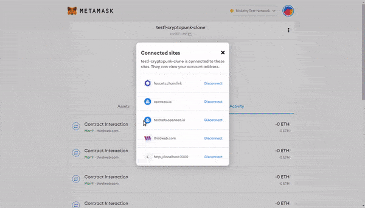
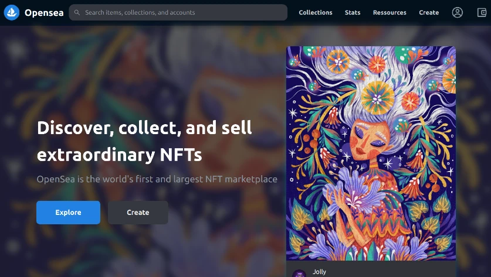

<!--
#  -->

## Build OpenSea Blockchain Web 3.0 App with Next.js | Sanity.io | thirdweb

 

#### Credits:

click to unfold

 

Big thanks to **[CleverProgrammers](https://www.youtube.com/c/CleverProgrammer/videos)** , for sharing this **Great tutorial** on how to set up an **OpenSea Blockchain Web 3.0 App with Next.js | [Sanity.io](https://www.sanity.io/) | [thirdweb](https://thirdweb.com) | Tailwind | [Alchemy](https://www.alchemy.com/)**

 

##### check it out: [video tutorial](https://youtu.be/x3eRXeMB-4k)

##### Check this other tutorial:

##### [Build your own NFT marketplace like OpenSea clone with solidity,openzeppelin and polygon (SUBSCRIBE)](https://youtu.be/7Q5E6RvLlUw)

 

# Docs

> **Blockchain development:** Smart Contracts, security, IDE, Truffle & hardhat, Etherscan, Dapp | **NFT:** ERC's ... [all here](./z_articles.md) ✋

 

 

 

---

 

#### Login:

click to unfold

    

#### Login in Metamask : [metamask](https://metamask.io/)

#### Login in ThirdWeb : [Thirdweb](https://bit.ly/3EJLftx)

#### Login [Opensea](https://testnets.opensea.io/)

 

> **yarn dev** to start server on 3000 and in **sanity**, to start server sanity on 3333 🌵 but log into: cd studio then type **sanity start**

 

### Fake eth

[faucets.chain](https://faucets.chain.link/rinkeby)

 

 
 

#### Branches

click to unfold

###### [1-yarn-default-setup](https://github.com/nadiamariduena/opensea-marketplace/tree/1-yarn-default-setup)

###### [2.sanityio-installation](https://github.com/nadiamariduena/opensea-marketplace/tree/2.sanityio-installation)

###### [3-metamask-thirweb-connection-market-nft-setup-sanity-last-details](https://github.com/nadiamariduena/opensea-marketplace/tree/3-metamask-thirweb-connection-market-nft-setup-sanity-last-details)

###### [4-header-tailwing-routing](https://github.com/nadiamariduena/opensea-marketplace/tree/4-header-tailwing-routing)

###### [5-hero-component](https://github.com/nadiamariduena/opensea-marketplace/tree/5-hero-component)

###### [6-sanity-auth-and-notification-with-toaster](https://github.com/nadiamariduena/opensea-marketplace/tree/6-sanity-auth-and-notification-with-toaster)

###### [7-collection-page-nftmodule-marketplace-listing-alchemy-dynamic.creating-user-sanity](https://github.com/nadiamariduena/opensea-marketplace/tree/7-collection-page-nftmodule-marketplace-listing-alchemy-dynamic.creating-user-sanity)

###### [8-nft-individualpath-imagevisibility-issue-purchase-button](https://github.com/nadiamariduena/opensea-marketplace/tree/8-nft-individualpath-imagevisibility-issue-purchase-button)

##### [9-deployment-cors-sanity](https://github.com/nadiamariduena/opensea-marketplace/tree/9-deployment-cors-sanity)

 

 

<!--  ok cool now how can we do it for several markets and not just one -->

#### See More:

click to unfold

 

#### Auth

#### Payment

 

 

