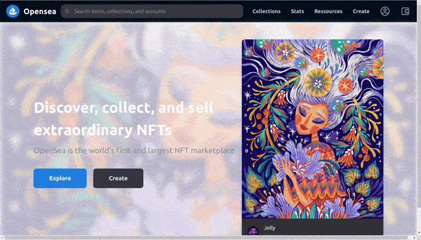
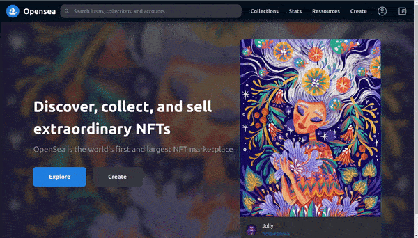

[](https://emoji.gg/emoji/8285-puppycat-pose)

## Build OpenSea Blockchain Web 3.0 App with Next.js | Sanity.io | thirdweb

#### [check the video tutorial here](https://youtu.be/x3eRXeMB-4k)

<br>

#### Check this other tutorial for more details on this <u>Topic</u>

##### [Build your own NFT marketplace like OpenSea clone with solidity,openzeppelin and polygon (SUBSCRIBE)](https://youtu.be/7Q5E6RvLlUw)

<br>

---

<br>

# Docs

> **Blockchain development:** Smart Contracts, security, IDE, Truffle & hardhat, Etherscan, Dapp | **NFT:** ERC's ... [all here](./z_articles.md) ✋

<br>
<br>

## Interesting articles & links:

##### How to make money with NFT as a developer?

[How to make money with NFT as a developer?](https://youtu.be/5_Wu_X4LnAw)

<br>

##### NFT Marketplaces

> NFT marketplace rankings and analysis. Find non-fungible token trading volumes, number of traders per NFT marketplace and more key metrics.

[NFT Marketplaces](https://dappradar.com/nft/marketplaces) ✋

<br>

---

<br>

# Login:

#### Login in Metamask : [metamask](https://metamask.io/)

#### Login in ThirdWeb : [Thirdweb](https://bit.ly/3EJLftx)

#### Login [Opensea](https://testnets.opensea.io/)

 <br>

> **yarn dev** to start server on 3000 and **sanity start** to start server sanity on 3333 🌵

## <br>

<br>
<br>

# 🌈

## Hero component

- Create the **Hero.js** inside the **components folder**, then import it inside the **pages/index**

<br>

##### [Hero styles](https://drive.google.com/drive/folders/1BS_tG_B7kH3pJVBu6KJiLgsk4T2gt9Jr)

<br>

#### So here there is nothing ordinary, only the tailwind part but if you know about css, you understand what is happeing.

- for example: it has a position relative, it s relative also the wrapper, than the fontsize is at 46px etc

<br>

- this [rounded-full](https://tailwindcss.com/docs/border-radius) on the images is a **border-radius**

<br>

- **h-screen** height: 100vh;

```javascript
import React from 'react'

//

// Hero.js
const style = {
  wrapper: `relative`,
  //BACKGROUND IMAGE and opacity, but keep in mind that another color is inside the styles/globals.css
  //this is a div behind the one with the text and the img, that is why here below you have the before:absolute
  container: `before:content-[''] before:bg-red-500 before:absolute before:top-0 before:left-0 before:right-0 before:bottom-0 before:bg-[url('https://lh3.googleusercontent.com/ujepnqpnL0nDQIHsWxlCXzyw4pf01yjz1Jmb4kAQHumJAPrSEj0-e3ABMZlZ1HEpJoqwOcY_kgnuJGzfXbd2Tijri66GXUtfN2MXQA=s250')] before:bg-cover before:bg-center before:opacity-30 before:blur`,
  //
  contentWrapper: `flex h-screen relative justify-center flex-wrap items-center`,

  //
  copyContainer: `w-1/2    `,

  //
  title: `relative text-white text-[46px] font-semibold`,
  description: `text-[#8a939b] container-[400px] text-2xl mt-[0.8rem] mb-[2.5rem]`,
  ctaContainer: `flex`,
  accentedButton: ` relative text-lg font-semibold px-12 py-4 bg-[#2181e2] rounded-lg mr-5 text-white hover:bg-[#42a0ff] cursor-pointer`,
  button: ` relative text-lg font-semibold px-12 py-4 bg-[#363840] rounded-lg mr-5 text-[#e4e8ea] hover:bg-[#4c505c] cursor-pointer`,
  //
  //img large -----------
  cardContainer: `rounded-[3rem] bg-cyan-500 shadow-lg shadow-cyan-500/50`,
  //
  //https://tailwindcss.com/docs/box-shadow-color
  //
  infoContainer: `h-20 bg-[#313338] p-4 rounded-b-lg flex items-center text-white`,
  author: `flex flex-col justify-center ml-4`,
  name: ``,
  infoIcon: `flex justify-end items-center flex-1 text-[#8a939b] text-3xl font-bold`,
}
//
//

const Hero = () => {
  return (
    <div className={style.wrapper}>
      <div className={style.container}>
        {/*  */}
        <div className={style.contentWrapper}>
          <div className={style.copyContainer}>
            <div className={style.title}>
              Discover, collect, and sell extraordinary NFTs
            </div>
            <div className={style.description}>
              OpenSea is the world&apos;s first and largest NFT marketplace
            </div>
            <div className={style.ctaContainer}>
              <button className={style.accentedButton}>Explore</button>
              <button className={style.button}>Create</button>
            </div>
          </div>
          <div className={style.cardContainer}>
            {/* 
              
              Big image
              
              
              */}
            
            <div className={style.infoContainer}>
              {/* 
                
                
                img avatar 
                
                
                */}

              

              {/* 
              
              
              
              */}
              <div className={style.author}>
                <div className={style.name}>Jolly</div>
                <a
                  className="text-[#1868b7]"
                  href="https://opensea.io/assets/0x495f947276749ce646f68ac8c248420045cb7b5e/2324922113504035910649522729980423429926362207300810036887725141691069366277"
                >
                  hola-kanola
                </a>
              </div>
            </div>
          </div>
        </div>
      </div>
    </div>
  )
}

export default Hero
```

<br>
<br>

#### Now lets get rid of the ugly x direction bar from the bottom of the page

[]()

- Go to the **styles** folder and inside the **globals.css**

```css
html,
body {
  background-color: #202225;
  padding: 0;
  margin: 0;

  overflow-x: hidden; ✋
}

a {
  color: inherit;
  text-decoration: none;
}

* {
  box-sizing: border-box;
}
```

<br>

#### He didnt add the overflow-x:hidden , but i had to because with the setting above, the bars remained.

[]()

<br>
<br>
