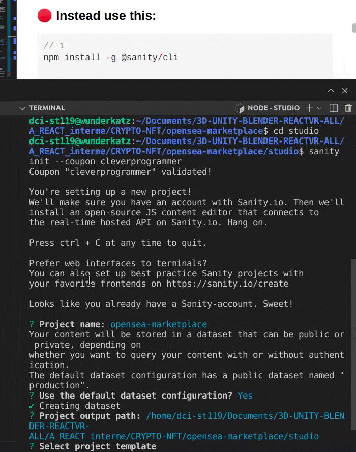
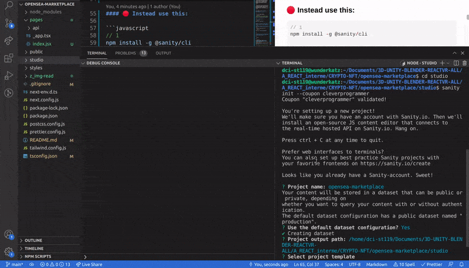

## Build OpenSea Blockchain Web 3.0 App with Next.js | Sanity.io | thirdweb

#### [check the video tutorial here](https://youtu.be/x3eRXeMB-4k)

<br>

#### Check this other tutorial for more details on this <u>Topic</u>

[Build your own NFT marketplace like OpenSea clone with solidity,openzeppelin and polygon (SUBSCRIBE)](https://youtu.be/7Q5E6RvLlUw)

<br>
<br>

---

<br>
<br>

# 🌈

### 1. Installation

[click here to see the installation](./z_installation.md)

<br>
<br>

---

<br>

### 2. Next thing we need to do, is set up the database with [SANITY.IO](https://javascript.plainenglish.io/what-is-sanity-io-c0a58d66342f)

<br>

- When you start a new project on Sanity.io, you'll get access to the real-time datastore. This is a schemaless backend that lets you store and query JSON documents, and subscribe to real-time changes.

<br>

- Sanity Studio is the place where you edit and manage your content. Sanity Studio is an open-source CMS that connects to Sanity. io's datastore. It's a single page application written in React and published on npm

<br>

# ✋ [SANITY.IO](https://javascript.plainenglish.io/what-is-sanity-io-c0a58d66342f) set up

<br>

- Type the following command ⚠️ **without** promo

```javascript
// If you want to get free sanity stuff, DONT ⚠️ do this one as it doesnt have the reduction deal from the "clever programmer"
npm install -g @sanity/cli && sanity init
```

<br>

## 🔴 Instead use this:

```javascript
// 1
npm install -g @sanity/cli

```

<br>

#### Once its installed, create a folder in the <u>'root'</u> , call it studio, then <u>cd studio</u> in your visual studio terminal

<br>

- Here you are adding the coupon with free:

> 200.000 api requests and more... [read more here](https://www.sanity.io/freecodecamp) 👾

```javascript

sanity init --coupon cleverprogrammer

```

<br>

#### After that you will be asked to create an account (if you dont have), choose with the arrows then click enter

<br>

- result ✋

<br>

```javascript
npm does not support Node.js v15.6.0
You should probably upgrade to a newer version of node as we
can't make any promises that npm will work with this version.
You can find the latest version at https://nodejs.org/

// more data but i will only add the below:

? Project name: opensea-blockchain-clone
```

<br>

#### After this, keep hiting enter

> ? **Project name**: opensea-blockchain-clone

<br>

#### then it will ask you:

- Type: **Y** for yes

```javascript
? Use the default dataset configuration? (Y/n

```

<br>

#### then it will ask you :

```javascript
? Project output path: (/home/dci-st119/Documents/3D-UNIT
Y-BLENDER-REACTVR-ALL/A_REACT_interme/CRYPTO-NFT/oopensea-
blockchain-clone/studio)
```

<br>

#### then it will ask you:

- Select Project template:

- **choose:** <u>Clean project with no predefined schemas</u>

<br>

#### Now it will install a lot of stuff inside the <u> studio </u>

<br>

> ###### ⚠️ To be sure that your project is connected to github, go to your applications settings in [github](https://github.com/settings/applications), and check if you have [Sanity.io](https://www.sanity.io/manage) , also try to log in to your sanity account

<br>

<br>

# 🌈

#### While its loading, go to the .gitignore and modify this:

- delete the slash

```javascript
// before
/node_modules

//
//after
node_modules

```

- the reason for this, is because we will have 2 node modules, one on the root and 1 inside the studio. By doing that e will ignore both

<br>

<br>
<br>

[]()

#### Here you can see that we have 2 node modules

[]()

 <br>
 <br>

#### Now that we have successfully installed sanity, lets go to the <u>studio/schemas</u> and add the following:

<br>

- If you notice, its a bit similar to the **MONGODB schema**

<br>

```javascript
types: schemaTypes.concat([
  {
    name: 'users',
    title: 'Users',
    type: 'document',
    fields: [
      {
        name: 'userName',
        title: 'User Name',
        type: 'string',
      },
      {
        name: 'walletAddress',
        title: 'Wallet Address',
        type: 'string',
      },
      {
        name: 'profileImage',
        title: 'Profile Image',
        type: 'image',
      },
      {
        name: 'bannerImage',
        title: 'Banner Image',
        type: 'image',
      },
      {
        name: 'twitterHandle',
        title: 'Twitter Handle',
        type: 'string',
      },
      {
        name: 'igHandle',
        title: 'Instagram Handle',
        type: 'string',
      },
    ],
  },
  {
    name: 'marketItems',
    title: 'Market Items',
    type: 'document',
    fields: [
      {
        name: 'title',
        title: 'Title',
        type: 'string',
      },
      {
        name: 'contractAddress',
        title: 'Contract Address',
        type: 'string',
      },
      {
        name: 'description',
        title: 'Description',
        type: 'string',
      },
      {
        name: 'createdBy',
        title: 'Created By',
        type: 'reference',
        to: [{ type: 'users' }],
      },
      {
        name: 'volumeTraded',
        title: 'Volume Traded',
        type: 'number',
      },
      {
        name: 'floorPrice',
        title: 'Floor Price',
        type: 'number',
      },
      {
        name: 'owners',
        title: 'Owners',
        type: 'array',
        of: [{ type: 'reference', to: [{ type: 'users' }] }],
      },
      {
        name: 'profileImage',
        title: 'Profile Image',
        type: 'image',
      },
      {
        name: 'bannerImage',
        title: 'Banner Image',
        type: 'image',
      },
    ],
  },
])
/* Your types here! */
```
