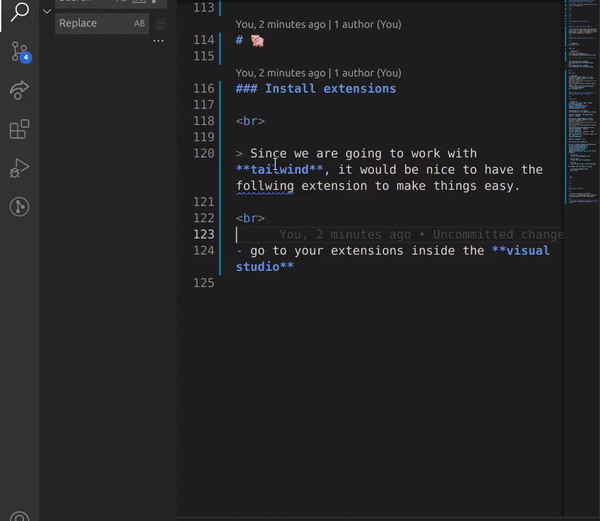
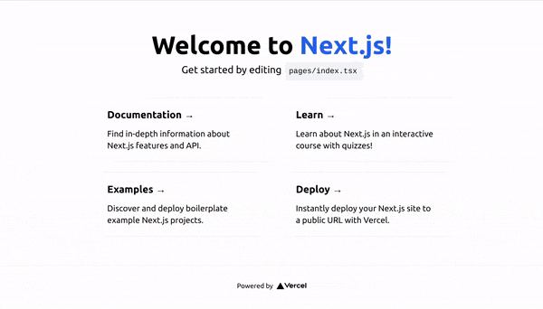
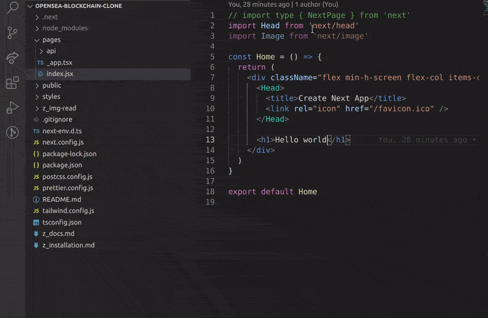

## Build OpenSea Blockchain Web 3.0 App with Next.js | Sanity.io | thirdweb

#### [check the video tutorial here](https://youtu.be/x3eRXeMB-4k)

<br>

#### Check this other tutorial for more details on this <u>Topic</u>

[Build your own NFT marketplace like OpenSea clone with solidity,openzeppelin and polygon (SUBSCRIBE)](https://youtu.be/7Q5E6RvLlUw)

<br>
<br>

---

<br>
<br>

# 🌈

<br>

## Installation & configuration

<br>

#### Start by setting up <u>YARN</u>

> Since its the first time I will work with yarn, I must to admit I had some difficulty installing it, anyway I discovered a lot of stuff while looking for a solution.

<br>

#### So what worked for me in the end:

<br>

```javascript
npm install yarn
```

#### then

```javascript
//the one i used ✋
npx create-next-app@latest -e with-tailwindcss opensea-blockchain-clone
//-------------------------------------------
//

```

<br>

#### Result

```javascript
Downloading files for example with-tailwindcss. This might take a moment.

Installing packages. This might take a couple of minutes.

npm does not support Node.js v15.6.0
You should probably upgrade to a newer version of node as we
can't make any promises that npm will work with this version.
You can find the latest version at https://nodejs.org/
npm WARN EBADENGINE Unsupported engine {
npm WARN EBADENGINE   package: 'postcss-js@4.0.0',
npm WARN EBADENGINE   required: { node: '^12 || ^14 || >= 16' },
npm WARN EBADENGINE   current: { node: 'v15.6.0', npm: '8.5.3' }
npm WARN EBADENGINE }

added 116 packages in 2m

Initialized a git repository.

Success! Created opensea-marketplace at /home/dci-st119/Documents/3D-UNITY-BLENDER-REACTVR-ALL/A_REACT_interme/CRYPTO-NFT/opensea-marketplace
Inside that directory, you can run several commands:

  npm run dev
    Starts the development server.

  npm run build
    Builds the app for production.

  npm start
    Runs the built app in production mode.

We suggest that you begin by typing:

  cd opensea-marketplace
  npm run dev


```

<br>

<br>

#### But if you want to choose this one:

```javascript

///
npx create-next-app --example with-tailwindcss with-tailwindcss-app
# or
yarn create next-app --example with-tailwindcss with-tailwindcss-app
```

<br>

### result:

```javascript
npm does not support Node.js v15.6.0
You should probably upgrade to a newer version of node as we
can't make any promises that npm will work with this version.
You can find the latest version at https://nodejs.org/
Need to install the following packages:
  create-next-app@latest
Ok to proceed? (y) ✋
```

#### ✋ type <u>y</u> (to the question in the code above), then click enter

<br>

#### result

```javascript
Creating a new Next.js app in /home/dci-st119/Documents/3D-UNITY-BLENDER-REACTVR-ALL/A_REACT_interme/CRYPTO-NFT/opensea-blockchain-clone.

Downloading files for example with-tailwindcss. This might take a moment.

Installing packages. This might take a couple of minutes.

npm does not support Node.js v15.6.0
You should probably upgrade to a newer version of node as we
can't make any promises that npm will work with this version.
You can find the latest version at https://nodejs.org/
npm WARN EBADENGINE Unsupported engine {
npm WARN EBADENGINE   package: 'postcss-js@4.0.0',
npm WARN EBADENGINE   required: { node: '^12 || ^14 || >= 16' },
npm WARN EBADENGINE   current: { node: 'v15.6.0', npm: '8.5.3' }
npm WARN EBADENGINE }

added 116 packages in 17s

Initialized a git repository.

Success! Created opensea-blockchain-clone at /home/dci-st119/Documents/3D-UNITY-BLENDER-REACTVR-ALL/A_REACT_interme/CRYPTO-NFT/opensea-blockchain-clone
Inside that directory, you can run several commands:

  npm run dev
    Starts the development server.

  npm run build
    Builds the app for production.

  npm start
    Runs the built app in production mode.

We suggest that you begin by typing:

  cd opensea-blockchain-clone
  npm run dev


```

 <br>
 <br>

---

 <br>

# Git 🍨

##### To save the repo, do as always but instead of:

```javascript
// before
git push -u origin master
//
//

// after
git push -u origin main
```

<br>

- then you can continue to use the **git push** as usual

<br>
<br>

---

<br>
 <br>

# 🐖

### Install extensions

<br>

> Since we are going to work with **tailwind**, it would be nice to have the follwing extension to make things easy.

<br>

- go to your extensions inside the **visual studio** and type: tailwind

<br>

[]()

<br>
<br>

---

<br>
<br>

# launch 🌈

<br>

#### To launch the server and see the default page in the browser

<br>

- Instead of typing npm start, do **yarn dev** ✋

<br>
<br>

[]()

<br>

### Change the type of the file:

[]()

<br>

#### As you can notice, we have a typescript setup, but here below you can change it to jsx if you want(of course you need to change the type of the file like in the img above).

<br>

```javascript
//
//
//before
import type { NextPage } from 'next'
import Head from 'next/head'
import Image from 'next/image'

const Home: NextPage = () => {
//
//
//
// after
// import type { NextPage } from 'next'
import Head from 'next/head'
import Image from 'next/image'

const Home = () => {
  return (
```

---
