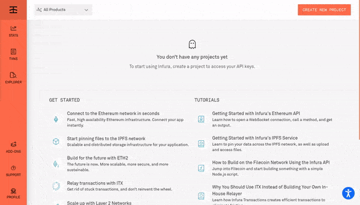
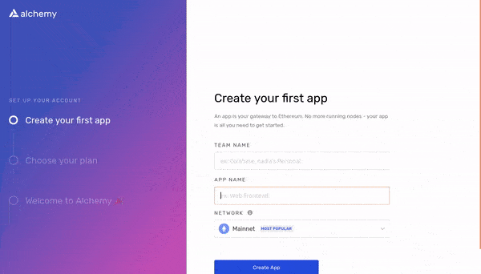
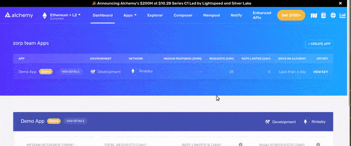
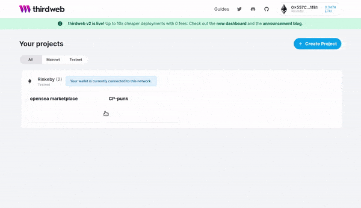
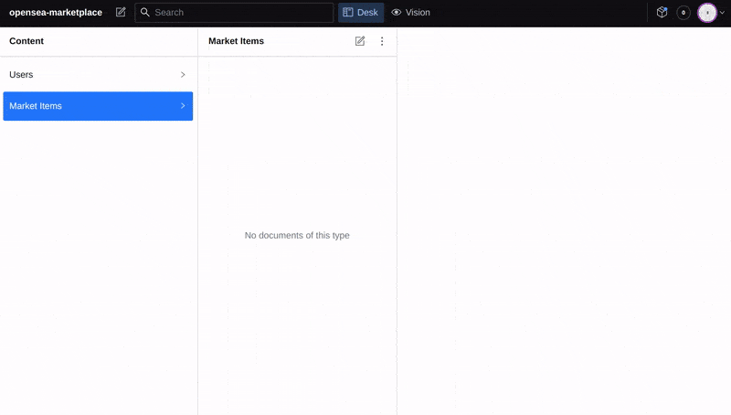
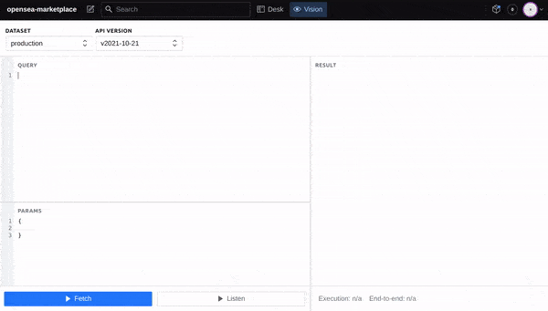
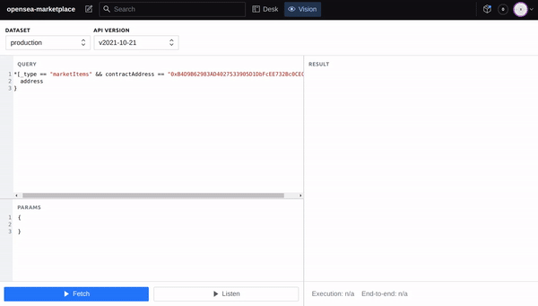
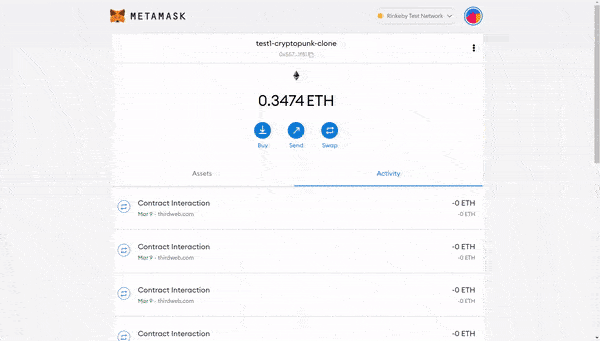
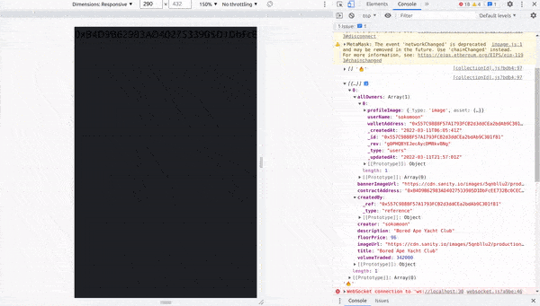
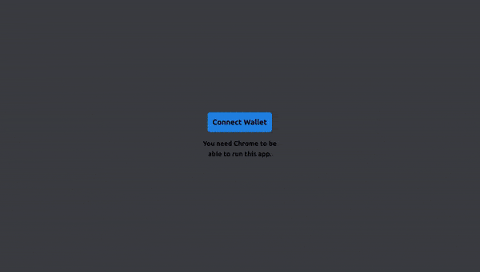

[](https://emoji.gg/emoji/8285-puppycat-pose)

## Build OpenSea Blockchain Web 3.0 App with Next.js | Sanity.io | thirdweb

#### [check the video tutorial here](https://youtu.be/x3eRXeMB-4k)

<br>

#### Check this other tutorial for more details on this <u>Topic</u>

##### [Build your own NFT marketplace like OpenSea clone with solidity,openzeppelin and polygon (SUBSCRIBE)](https://youtu.be/7Q5E6RvLlUw)

<br>

---

<br>

# Docs

> **Blockchain development:** Smart Contracts, security, IDE, Truffle & hardhat, Etherscan, Dapp | **NFT:** ERC's ... [all here](./z_articles.md) ✋

<br>
<br>

## Interesting articles & links:

##### How to make money with NFT as a developer?

[How to make money with NFT as a developer?](https://youtu.be/5_Wu_X4LnAw)

<br>

##### NFT Marketplaces

> NFT marketplace rankings and analysis. Find non-fungible token trading volumes, number of traders per NFT marketplace and more key metrics.

[NFT Marketplaces](https://dappradar.com/nft/marketplaces) ✋

<br>

---

<br>

# Login:

#### Login in Metamask : [metamask](https://metamask.io/)

#### Login in ThirdWeb : [Thirdweb](https://bit.ly/3EJLftx)

#### Login [Opensea](https://testnets.opensea.io/)

 <br>

> **yarn dev** to start server on 3000 and **sanity start** to start server sanity on 3333 🌵

## <br>

<br>
<br>
<!-- []() -->
# 🍨 🥭

<br>

# Collections

#### Now we need to get back to the collections, if you remember we already started it a bit [Here](https://github.com/nadiamariduena/opensea-marketplace/tree/4-header-tailwing-routing), so now we need to make it work:

- SO this is what we have in collections

```javascript
import React from 'react'
import { useRouter } from 'next/router'
import Link from 'next/link'

const collection = () => {
  const router = useRouter()
  //
  console.log(router.query)
  console.log(router.query.collectionId)
  return (
    <Link href="/">
      <h2>{router.query.collectionId}</h2>
    </Link>
  )
}

export default collection
```

<br>

### Start by adding the style

```javascript
const style = {
  bannerImageContainer: `h-[20vh] w-screen overflow-hidden flex justify-center items-center`,
  // h-20	height: 5rem; /* 80px */
  //w-screen	width: 100vw;
  //
  bannerImage: `w-full object-cover`,
  // w-full	width: 100%;  object-cover https://tailwindcss.com/docs/object-fit
  //
  infoContainer: `w-screen px-4`,
  // w-screen	width: 100vw;
  //
  //
  midRow: `w-full flex justify-center text-white`,
  endRow: `w-full flex justify-end text-white`,
  profileImg: `w-40 h-40 object-cover rounded-full border-2 border-[#202225] mt-[-4rem]`,
  //
  //
  socialIconsContainer: `flex text-3xl mb-[-2rem]`,
  //mb = margin-bottom https://shuffle.dev/tailwind/classes/margins/mb-auto
  //
  socialIconsWrapper: `w-44`,
  socialIconsContent: `flex container justify-between text-[1.4rem] border-2 rounded-lg px-2`,
  socialIcon: `my-2`,
  divider: `border-r-2`,
  title: `text-5xl font-bold mb-4`,
  createdBy: `text-lg mb-4`,
  statsContainer: `w-[44vw] flex justify-between py-4 border border-[#151b22] rounded-xl mb-4`,
  collectionStat: `w-1/4`,
  statValue: `text-3xl font-bold w-full flex items-center justify-center`,
  ethLogo: `h-6 mr-2`,
  statName: `text-lg w-full text-center mt-1`,
  description: `text-[#8a939b] text-xl w-max-1/4 flex-wrap mt-4`,
}
```

<br>
<br>

#### Now Add the following:

- Here we will need to add the **provider coming from the web3** , than we will need to add the **collectionId**

<br>

```javascript
import React, { useEffect, useState, useMemo } from 'react'
import { useRouter } from 'next/router'
import Link from 'next/link'


//
import { useWeb3 } from '@3rdweb/hooks' ✋
import { client } from '../../lib/sanityClient'  ✋
//
/*


*/
const collection = () => {
  const router = useRouter()

  //
  const { provider } = useWeb3() ✋
  const { collectionId } = router.query ✋
  //
```

<br>

#### Set up an <u>states</u> for collections, nft's & listings coming from the collections we created in the [thirdweb](https://thirdweb.com/dashboard)

- the state is going to give us the possibility to have access to all I mentioned above

```javascript
const [collection, setCollection] = useState({})
const [nfts, setNfts] = useState([])
const [listings, setListings] = useState([])
```

<br>

- the state is going to get **access to all of the below**

<br>

[]()

<br>
<br>

# 🌈 [INFURA ](https://infura.io/)

- "Our suite of high availability **APIs** and Developer Tools provide quick, reliable access to the Ethereum and **IPFS networks** so you can focus on building and scaling next generation software."

<br>

### We are going to need to open an account with INFURA

> ##### "Another service that you will use is INFURA which is an API that runs ethereum clients for you."

##### ⚠️ its not easy to run ethereum client, so infura is very useful when you want to send a transaction to mainnet

<br>

#### Once you have your [INFURA ](https://infura.io/) account, open an [ALCHEMY](https://www.alchemy.com/) account

<br>

#### How does Alchemy work?

> It replaces the **nodes** that businesses use to read and write blockchains with a faster, more scalable decentralized architecture. **It also provides tools for analytics, monitoring, alerting, logging and debugging for cryptocurrency-connected software**

<br>

> “Right now people are trying to build skyscrapers with picks and shovels. We need to give them construction equipment,” Alchemy co-founder and CEO Nikil Viswanathan tells me. “None of this exists for blockchain.”

##### read more: [Alchemy is secretly fising blockchain nightmare](https://consent.yahoo.com/v2/collectConsent?sessionId=3_cc-session_f0f9b10d-bde1-442d-a23d-c50d9a4bd975)

<br>

- So this is how they look like, but its not over yet

[]()

<br>
<br>

#### Complete the account with [ALCHEMY](https://www.alchemy.com/)

[]()

<br>

#### While in Alchemy, create a <u>new app</u>

- Grab the **http key** (in the img i took the other one, but you have to take the http one)

<br>

- 🔴 I will be deleting this at the end of the project, so its useless for you to copy it

```javascript
// HTTP KEY:   https://eth-rinkeby.alchemyapi.io/v2/oneD5PzlO3p18PfmfbguZhfsDWCUvhI2
```

[]()

<br>
<br>

---

<br>
<br>

# 🐄

## NFT module 🌞

#### Now lets create a function that will help us to get access to the <u>NFT module</u>

##### [Build OpenSea Blockchain Web 3.0 App with Next.js | Sanity.io | thirdweb](https://youtu.be/x3eRXeMB-4k?t=4126)

<br>

> In this function we will use **Memo** , memo is kind of like a **useEffect** but also has some caching (cache) build into it.

```javascript
const nftModule = useMemo(() => {
  //
})
```

#### Memo functions

> Memoization is an optimization technique that speeds up applications by storing the results of expensive function calls and returning the cached result when the same inputs are supplied again.

<br>

> (Or **"memoised function"**) A function that remembers which arguments it has been called with and the result returned and, if called with the same arguments again, returns the result from its memory rather than recalculating it. Memo functions were invented by Professor Donald Michie of Edinburgh University.s

<br>

### Lets continue

##### In the tutorial he didnt explain how to get the api key from infura, so go there and create an app like you did with the alchemy one, once the app is done you will have api's to use, but here below we will be using the <u>alchemy one</u>.

<br>

- the dependency is going to be the provider, so if the provider **dont exist** return it, otherwise e are going to create a thirdweb sdk: **new ThirdwebSDK**, to get our signer **provider.getSigner()**, and we are going to use our API key: **h ttps://eth-rinkeby...**, and than we are going to return the NFT MODULE: **sdk.getNFTModule(collectionId)**

<br>

```javascript
const nftModule = useMemo(() => {
  if (!provider) return

  const sdk = new ThirdwebSDK(
    provider.getSigner(),
    'https://eth-rinkeby.alchemyapi.io/v2/oneD5PzlO3p18PfmfbguZhfsDWCUvhI2'
  )
  return sdk.getNFTModule(collectionId)
}, [provider])
```

<br>
<br>

#### Now lets get another function that gets all the nft's inside a collection

- the dependency is going to be this **[nftModule]**, so whenever a nftModule is loaded from here **const nftModule** (the function above), this is **useEffect** will run, but if the **(!nftModule)** dont exist then we are going to return it, but if does exist we are going the **IIFE (Immediately Invoked Function Expression)** that is going to call itself immediately and when it happens, we will be getting the nfts, this will update the nft's variable here: **setNfts(nfts)**

<br>

```javascript
useEffect(() => {
  if (!nftModule) return
  ;(async () => {
    const nfts = await nftModule.getAll()

    setNfts(nfts)
  })()
}, [nftModule])
```

<br>

## Marketplace 🌞

<br>

#### Now we are going to get access to the marketplace module

- Like you see it here in the beginning of the gif

[]()

<br>

```javascript
const marketPlaceModule = useMemo(() => {
  if (!provider) return

  const sdk = new ThirdwebSDK(
    provider.getSigner(),
    'https://rinkeby.infura.io/v3/a464b9152d8c466c8a94a514fce8e837'
  )
  return sdk.getMarketplaceModule('0xCdA1334a27C272c7cFF02bc2CC1563b60e540402')
}, [provider])
```

<br>

[]()

<br>

## Listings 🌞

#### Now lets get all the listings inside the collection, we will be using another useEffect, this useEffect will look for a marketplace module..

- This will practically do the same process, it will check if we have a **!marketPlaceModule** and if it don't, then it will return it, but if it does, then call the **iife** run it immediately and we will **set** all the listings **setListings** to: the listings that we actually get from the marketplace **marketPlaceModule.getAllListings()**, so as soon as we get the "we set them"

<br>

```javascript
// get all listings in the collection
useEffect(() => {
  if (!marketPlaceModule) return
  ;(async () => {
    setListings(await marketPlaceModule.getAllListings())
  })()
}, [marketPlaceModule])
```

<br>
<br>

### Now lets go to your [SANITY.IO](http://localhost:3333/)

##### at : http://localhost:3333/

> **yarn dev** to start server on 3000

> and **sanity start** to start server sanity on 3333

<br>

# ⚠️

#### There we will need to generate the following:

- The code below is from the [original repository](https://github.com/CleverProgrammers/opensea-blockchain-youtube/blob/main/pages/collections/%5BcollectionId%5D.js) but **you need your own, with your own data** , so dont copy and paste it as it will give your errors, since the **url contains an image that you need to generate in sanity**

<br>

```javascript
const fetchCollectionData = async (sanityClient = client) => {
    const query = `*[_type == "marketItems" && contractAddress == "${collectionId}" ] {
      "imageUrl": profileImage.asset->url,
      "bannerImageUrl": bannerImage.asset->url,
      volumeTraded,
      createdBy,
      contractAddress,
      "creator": createdBy->userName,
      title, floorPrice,
      "allOwners": owners[]->,
      description
    }`
```

<br>

### So lets go to sanity to do it:

<br>

- Click on **Market Items** , click on the icon with the pencil

<br>

- Go to the **thirdweb** and grab the nft collection name and paste it in **title** (in sanity)

<br>

- take the id from the nft collection in thirdwaeb, then paste it inside the sanity **contract address**

- Add a description, volume traded, floor price

<br>

- Add a created by

<br>

- add **Owners**, if there are many you can add them as well

<br>

[]()

<br>

## VISION

#### In the next step we ill be using the [VISION plugin](https://www.sanity.io/docs/the-vision-plugin) <u> from sanity </u>

<br>

##### Quickly test your GROQ queries using this studio plugin

Vision is a plugin that lets you quickly test your GROQ queries right from the Studio. It shows up as a tool in the navigation bar when installed, and is part of the default Studio setup when running in development mode.

#### Add your Nft id here below

```javascript
*[_type == "marketItems" && contractAddress == "0xB4D9B62983AD4027533905D1DbFcEE732Bc0CEC7"]{
  address
}
```

> **This means the following:** get me "marketItems" type, and if the contract address is equal to this: 0xB4D9B62983AD4027533905D1DbFcEE732Bc0CEC7 , then get me whatever i ask inside the curly brackets

<br>
<br>

[]()

<br>
<br>

#### Here you will see that whatever we put inside the curly brackets is going to give us something once we click <u>FETCH</u> (of course whatever related to the data we just added)

<br>

[]()

<br>
<br>

### Now lets use it inside the code

- copy the query from sanity

```javascript
//this is my query with my own data
*[_type == "marketItems" && contractAddress == "0xB4D9B62983AD4027533905D1DbFcEE732Bc0CEC7"]{
   "imageUrl": profileImage.asset->url,
      "bannerImageUrl": bannerImage.asset->url,
      volumeTraded,
      createdBy,
      contractAddress,
      "creator": createdBy->userName,
      title, floorPrice,
      "allOwners": owners[]->,
      description
}
```

<br>

#### And paste it here, under the step 4, but hide the query code as we have to do a couple of things before that.

<br>
<br>

```javascript
//4 get all listings in the collection
//
useEffect(() => {
  if (!marketPlaceModule) return
  ;(async () => {
    setListings(await marketPlaceModule.getAllListings())
  })()
}, [marketPlaceModule])
//
// 5 the query from sanity

//   const query = `*[_type == "marketItems" && contractAddress == "0xB4D9B62983AD4027533905D1DbFcEE732Bc0CEC7"]{
//   "imageUrl": profileImage.asset->url,
//      "bannerImageUrl": bannerImage.asset->url,
//      volumeTraded,
//      createdBy,
//      contractAddress,
//      "creator": createdBy->userName,
//      title, floorPrice,
//      "allOwners": owners[]->,
//      description
// }`
```

<br>
<br>

### Create the function that is going to nest the query, since its an API it has to be nested in an ASYNC await function

```javascript
const fetchCollectionData = async (sanityClient = client, collectionId) => {
  const query = `*[_type == "marketItems" && contractAddress == "${collectionId}" ]`

  const collectionData = await sanityClient.fetch(query)

  // the query returns 1 object inside of an array
  await setCollection(collectionData[0])
}
```

<br>
<br>

### Now you can use it like so

- As you can notice, the **id** is not longer **hardcoded**

```javascript
const { provider } = useWeb3()
const { collectionId } = router.query 👍
const [collection, setCollection] = useState({})
//
//
//
const fetchCollectionData = async (
  sanityClient = client,
  collectionId = collectionId ✋
) => {
  const query = `*[_type == "marketItems" && contractAddress == "${collectionId ✋}" ] {
      "imageUrl": profileImage.asset->url,
      "bannerImageUrl": bannerImage.asset->url,
      volumeTraded,
      createdBy,
      contractAddress,
      "creator": createdBy->userName,
      title, floorPrice,
      "allOwners": owners[]->,
      description
    }`
  //
  //
  const collectionData = await sanityClient.fetch(query)

  // the query returns 1 object inside of an array
  await  ✋ setCollection(collectionData[0])
}
```

<br>

#### Now add a last useEffect

- In other words this useEffect below will **run** whenever you route into this page where the collection **[collectionId]** is, because it will pull the query from the **query parameters** , which is this **fetchCollectionData()**

```javascript
useEffect(() => {
  fetchCollectionData()
}, [collectionId])
```

<br>
<br>
<br>

#### 🔴 We are going to get some errors, to prevent them , add the following:

<br>

#### import the following

```javascript
import { client } from '../../lib/sanityClient'
import { ThirdwebSDK } from '@3rdweb/sdk'
```

<br>

## Install the sdk

##### [Getting Started with thirdweb SDK](https://portal.thirdweb.com/learn)

##### [Some guidance on using our SDK: Frontend vs Backend](https://portal.thirdweb.com/guides/sdk-guide)

<br>

#### why do we need this sdk?

> Here is a typical use case. You have an app (or are building one) and you want users to claim an nft. You have everything set up and just want that button. In this case you integrate our sdk in the frontend. The user triggers a transaction and the frontend(or client side) interacts with the blockchain. <br> <br> > **Example:** I click on the claim button and the client side makes sure my wallet pops up and I authorise the transaction.

<br>

- install it

```javascript
npm i @3rdweb/sdk
```

<br>

#### This is what you should have:

```javascript
  "dependencies": {
    "@3rdweb/hooks": "^1.9.2",
    "@3rdweb/sdk": "^1.42.0",
    "@sanity/client": "^3.2.0",
    "next": "latest",
    "react": "^17.0.2",
    "react-dom": "^17.0.2",
    "react-hot-toast": "^2.2.0",
    "react-icons": "^4.3.1"
  },
```

<br>

#### With this we shouldn't have any other issues (for now)

- Lets test it 🔥

<br>

[]()

<br>
<br>

### Now check if you are receiving the data

<br>

- 🔴 remove the **collectionId**, as it was giving me an empty array

```javascript
// before
const fetchCollectionData = async (
  sanityClient = client,
  collectionId = collectionId 🔴
) => {

// after
const fetchCollectionData = async (sanityClient = client) => {
```

<br>

- dont worry about the sockets errors, its because i disconnected from the server

[]()

<br>

#### Before moving on, lets see what we have

```javascript
import React, { useEffect, useState, useMemo } from 'react'
import { useRouter } from 'next/router'
import Link from 'next/link'

//
import { useWeb3 } from '@3rdweb/hooks'
import { client } from '../../lib/sanityClient'
import { ThirdwebSDK } from '@3rdweb/sdk'
//

//
//
//
const collection = () => {
  const router = useRouter()
  //
  const { provider } = useWeb3()
  const { collectionId } = router.query
  const [collection, setCollection] = useState({})
  const [nfts, setNfts] = useState([])
  const [listings, setListings] = useState([])
  //
  //
  //

  /*
1
- the dependency is going to be the provider, 
so if the provider **dont exist** return it, 
otherwise e are going to create a thirdweb 
sdk: **new ThirdwebSDK**, to get our signer 
**provider.getSigner()**, and we are going 
to use our API key: **h ttps://eth-rinkeby...**, 
and than we are going to return the
 NFT MODULE: **sdk.getNFTModule(collectionId)**


*/
  const nftModule = useMemo(() => {
    if (!provider) return

    const sdk = new ThirdwebSDK(
      provider.getSigner(),
      'https://eth-rinkeby.alchemyapi.io/v2/oneD5PzlO3p18PfmfbguZhfsDWCUvhI2'
    )
    return sdk.getNFTModule(collectionId)
  }, [provider])
  //
  //2 so here will be the same but this time is for the nft (read the descript in the branch 7 )
  useEffect(() => {
    if (!nftModule) return
    ;(async () => {
      const nfts = await nftModule.getAll()

      setNfts(nfts)
    })()
  }, [nftModule])
  //
  //
  // 3
  const marketPlaceModule = useMemo(() => {
    if (!provider) return

    const sdk = new ThirdwebSDK(
      provider.getSigner(),
      'https://eth-rinkeby.alchemyapi.io/v2/oneD5PzlO3p18PfmfbguZhfsDWCUvhI2'
    )
    return sdk.getMarketplaceModule(
      '0xCdA1334a27C272c7cFF02bc2CC1563b60e540402'
    )
  }, [provider])

  //4 get all listings in the collection
  useEffect(() => {
    if (!marketPlaceModule) return
    ;(async () => {
      setListings(await marketPlaceModule.getAllListings())
    })()
  }, [marketPlaceModule])
  //

  //
  //5
  const fetchCollectionData = async (sanityClient = client) => {
    const query = `*[_type == "marketItems" && contractAddress == "${collectionId}" ] {
      "imageUrl": profileImage.asset->url,
      "bannerImageUrl": bannerImage.asset->url,
      volumeTraded,
      createdBy,
      contractAddress,
      "creator": createdBy->userName,
      title, floorPrice,
      "allOwners": owners[]->,
      description
    }`
    //
    //
    const collectionData = await sanityClient.fetch(query)
    console.log(collectionData, '🔥')
    // the query returns 1 object inside of an array
    await setCollection(collectionData[0])
  }
  //
  //
  useEffect(() => {
    fetchCollectionData()
  }, [collectionId])

  //
  return (
    <Link href="/">
      <h2>{router.query.collectionId}</h2>
    </Link>
  )
}

export default collection
```

<br>
<br>

---

<br>
<br>

# 🌈

### Frontend part

#### Now that we are accessing the data, all we need to build is the front end to show the data

<br>

- import the following:

```javascript
import Header from '../../components/Header'
import { CgWebsite } from 'react-icons/cg'
import { AiOutlineInstagram, AiOutlineTwitter } from 'react-icons/ai'
import { HiDotsVertical } from 'react-icons/hi'
```

#### Lets build another component, we will be using this component here: [collectionId].js

- go to the components folder

- create the NFTCard.js, this component will contains the following:

```javascript
import React from 'react'

const NFTCard = ({ nftItem }) => {
  return 
}

export default NFTCard
```

#### now import it inside the collection component

```javascript
import NFTCard from '../../components/NFTCard'
```

<br>
<br>

- if the **collection?.bannerImageUrl** in other words...if the **banner Img** exist then show it..as **collection.bannerImageUrl** , else / if if it dont exist, show just a placeholder **https://via.placeholder.com/200**

<br>

```javascript
<div className="overflow-hidden">
  <Header />
  <div className={style.bannerImageContainer}>
    
  </div>
</div>
```

<br>

<br>

#### We are not going to waste time on this because what I am really looking for is the integration and other logical parts of the project...BUT if you really want to take your time, watch the tutorial minute 1:23:05 [Build OpenSea Blockchain Web 3.0 App with Next.js | Sanity.io | thirdweb](https://youtu.be/x3eRXeMB-4k?t=4985)

<br>
<br>

#### I added a couple of things to the original styles, just few things because it wasnt well structured( the images didnt have a space-between, the description didnt have enough margin) so this is what we have:

```javascript
import React, { useEffect, useState, useMemo } from 'react'
import { useRouter } from 'next/router'
import Link from 'next/link'

//
import { useWeb3 } from '@3rdweb/hooks'
import { client } from '../../lib/sanityClient'
import { ThirdwebSDK } from '@3rdweb/sdk'
//
import Header from '../../components/Header'
import { CgWebsite } from 'react-icons/cg'
import { AiOutlineInstagram, AiOutlineTwitter } from 'react-icons/ai'
import { HiDotsVertical } from 'react-icons/hi'
import NFTCard from '../../components/NFTCard'
//
//
//STYLES

const style = {
  bannerImageContainer: `h-[40vh] w-screen overflow-hidden flex justify-center items-center`,
  bannerImage: `w-full object-cover`,
  infoContainer: `w-screen px-4`,
  //
  midRow: `w-full flex justify-center text-white`,
  endRow: `w-full flex justify-end text-white`,
  //
  profileImg: `w-40 h-40 object-cover rounded-full border-2 border-[#202225] mt-[-4rem]`,
  socialIconsContainer: `flex text-3xl mb-[-2rem]`,
  socialIconsWrapper: `w-44`,
  socialIconsContent: `flex container justify-between text-[1.4rem] border-2 rounded-lg px-2`,
  socialIcon: `my-2`,
  divider: `border-r-2`,
  title: `text-5xl font-bold mb-4`,
  createdBy: `text-lg mb-4`,
  statsContainer: `w-[44vw] flex justify-between py-4 border border-[#151b22] rounded-xl mb-4`,
  collectionStat: `w-1/4`,
  statValue: `text-3xl font-bold w-full flex items-center justify-center`,
  ethLogo: `h-6 mr-2`,
  statName: `text-lg w-full text-center mt-1`,
  //
  description: `text-[#8a939b] my-8 text-xl w-max-1/4 flex-wrap mt-4`,
  //my-8:  https://tailwindcss.com/docs/margin#add-margin-to-a-single-side
}

//
const collection = () => {
  const router = useRouter()
  //
  const { provider } = useWeb3()
  const { collectionId } = router.query
  const [collection, setCollection] = useState({})
  const [nfts, setNfts] = useState([])
  const [listings, setListings] = useState([])

  /*
1
- the dependency is going to be the provider, 
so if the provider **dont exist** return it, 
otherwise e are going to create a thirdweb 
sdk: **new ThirdwebSDK**, to get our signer 
**provider.getSigner()**, and we are going 
to use our API key: **h ttps://eth-rinkeby...**, 
and than we are going to return the
 NFT MODULE: **sdk.getNFTModule(collectionId)**


*/
  const nftModule = useMemo(() => {
    if (!provider) return

    const sdk = new ThirdwebSDK(
      provider.getSigner(),
      'https://eth-rinkeby.alchemyapi.io/v2/oneD5PzlO3p18PfmfbguZhfsDWCUvhI2'
    )
    return sdk.getNFTModule(collectionId)
  }, [provider])
  //
  //2 so here will be the same but this time is for the nft (read the descript in the branch 7 )
  useEffect(() => {
    if (!nftModule) return
    ;(async () => {
      const nfts = await nftModule.getAll()

      setNfts(nfts)
    })()
  }, [nftModule])
  //
  //
  // 3
  const marketPlaceModule = useMemo(() => {
    if (!provider) return

    const sdk = new ThirdwebSDK(
      provider.getSigner(),
      'https://eth-rinkeby.alchemyapi.io/v2/oneD5PzlO3p18PfmfbguZhfsDWCUvhI2'
    )
    return sdk.getMarketplaceModule(
      '0xCdA1334a27C272c7cFF02bc2CC1563b60e540402'
    )
  }, [provider])

  //4 get all listings in the collection
  useEffect(() => {
    if (!marketPlaceModule) return
    ;(async () => {
      setListings(await marketPlaceModule.getAllListings())
    })()
  }, [marketPlaceModule])
  //
  //
  //5
  const fetchCollectionData = async (sanityClient = client) => {
    const query = `*[_type == "marketItems" && contractAddress == "${collectionId}" ] {
      "imageUrl": profileImage.asset->url,
      "bannerImageUrl": bannerImage.asset->url,
      volumeTraded,
      createdBy,
      contractAddress,
      "creator": createdBy->userName,
      title, floorPrice,
      "allOwners": owners[]->,
      description
    }`
    //
    //
    const collectionData = await sanityClient.fetch(query)
    console.log(collectionData, '🔥')
    // the query returns 1 object inside of an array
    await setCollection(collectionData[0])
  }
  //
  //
  useEffect(() => {
    fetchCollectionData()
  }, [collectionId])

  // console.log(router.query)
  // console.log(router.query.collectionId)
  //
  //
  return (
    <div className="overflow-hidden">
      <Header />
      <div className={style.bannerImageContainer}>
        
      </div>
      {/* ------- */}
      <div className={style.infoContainer}>
        <div className={style.midRow}>
          
        </div>
        {/* ----social network--- */}
        <div className={style.endRow}>
          <div className={style.socialIconsContainer}>
            <div className={style.socialIconsWrapper}>
              <div className={style.socialIconsContent}>
                <div className={style.socialIcon}>
                  <CgWebsite />
                </div>
                <div className={style.divider} />
                <div className={style.socialIcon}>
                  <AiOutlineInstagram />
                </div>
                <div className={style.divider} />
                <div className={style.socialIcon}>
                  <AiOutlineTwitter />
                </div>
                <div className={style.divider} />
                <div className={style.socialIcon}>
                  <HiDotsVertical />
                </div>
              </div>
            </div>
          </div>
        </div>
        {/* ------- created by  */}
        <div className={style.midRow}>
          <div className={style.title}>{collection?.title}</div>
        </div>
        <div className={style.midRow}>
          <div className={style.createdBy}>
            Created by{' '}
            <span className="text-[#2081e2]">{collection?.creator}</span>
          </div>
        </div>

        {/* ------- */}
        <div className={style.midRow}>
          <div className={style.statsContainer}>
            {/* --items---- */}
            <div className={style.collectionStat}>
              <div className={style.statValue}>{nfts.length}</div>
              <div className={style.statName}>items</div>
            </div>
            {/* ----all owners--- */}
            <div className={style.collectionStat}>
              <div className={style.statValue}>
                {collection?.allOwners ? collection.allOwners.length : ''}
              </div>
              <div className={style.statName}>owners</div>
            </div>
            {/* ----eth logo --- */}
            <div className={style.collectionStat}>
              <div className={style.statValue}>
                
                {collection?.floorPrice}
              </div>
              <div className={style.statName}>floor price</div>
            </div>
            {/* ----volume traded---  */}
            <div className={style.collectionStat}>
              <div className={style.statValue}>
                
                {collection?.volumeTraded}.5K
              </div>
              <div className={style.statName}>volume traded</div>
            </div>
            {/* ------- */}
          </div>
        </div>
        {/* ---
              
              Description: Bored Ape Yacht Club
              
              ---- */}
        <div className={style.midRow}>
          <div className={style.description}>{collection?.description}</div>
        </div>
      </div>

      {/* ----THE NFT CARDS --- */}
      <div className=" flex flex-wrap items-center justify-around">
        {nfts.map((nftItem, id) => (
          <NFTCard
            key={id}
            nftItem={nftItem}
            title={collection?.title}
            listings={listings}
          />
        ))}
      </div>
    </div>
  )
}

export default collection
```

<br>

[]()

<br>
<br>

### Lets continue with the card styling

- Here we will also add 2 props to keep track of the **Listing and the price**

```javascript
import React from 'react'
import { useEffect, useState } from 'react'
import { BiHeart } from 'react-icons/bi'
import Router from 'next/router'
//
//
//

const style = {
  wrapper: `bg-[#303339] flex-auto w-[14rem] h-[22rem] my-10 mx-5 rounded-2xl overflow-hidden cursor-pointer`,
  imgContainer: `h-2/3 w-full overflow-hidden flex justify-center items-center`,
  nftImg: `w-full object-cover`,
  details: `p-3`,
  info: `flex justify-between text-[#e4e8eb] drop-shadow-xl`,
  infoLeft: `flex-0.6 flex-wrap`,
  collectionName: `font-semibold text-sm text-[#8a939b]`,
  assetName: `font-bold text-lg mt-2`,
  infoRight: `flex-0.4 text-right`,
  priceTag: `font-semibold text-sm text-[#8a939b]`,
  priceValue: `flex items-center text-xl font-bold mt-2`,
  ethLogo: `h-5 mr-2`,
  likes: `text-[#8a939b] font-bold flex items-center w-full justify-end mt-3`,
  likeIcon: `text-xl mr-2`,
}
//
//

const NFTCard = ({ nftItem, title, listing }) => {
  //
  //

  const [isListed, setIsListed] = useState(false) ✋
  const [price, setPrice] = useState(0) ✋

  //
  //
  return 
}

export default NFTCard
```

<br>

#### Now we have to thing in the logic "in case there are not nft listed"

- **for example:** if we have 4 NFT'S 1 or 2 might not be listed

> **Listed** meaning you have them for sale in the **marketplace**, meaning that you went to the 3web platform and you put them and **listed** for sale

<br>

#### What we need to do, is we need to find where the matches are..we need to filter the items that are not listed and get them out from the users <u>possibilities</u>

#### check the video, as it can be complicated [1:30:07](https://youtu.be/x3eRXeMB-4k?t=5407)

<br>
<br>
<br>

### Lets add the useEffect

- This useEffect is going to have 2 dependencies: **[nftItem, listings]** that is going to fire when it sees un update

```javascript

const NFTCard = ({ nftItem, title, listings }) => {
  //
  //

  const [isListed, setIsListed] = useState(false)
  const [price, setPrice] = useState(0)

  //
  useEffect(() => {}, [nftItem, listings])
```

<br>
<br>

##### then we are going to loop through all of our listings

- and if our listing matches our **nft item**

```javascript
useEffect(() => {
  for (const listing of listings) {
    if (listing.asset.id === nftItem.id) {
      setIsListed(true)
      setPrice(listing.buyoutCurrencyValuePerToken.displayValue)
      break
    }
  }
}, [nftItem, listings])
```
