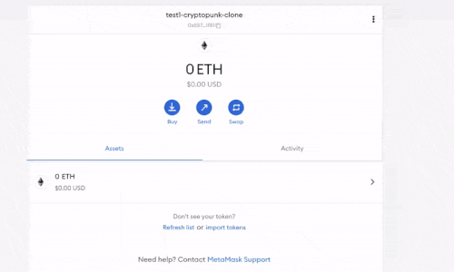
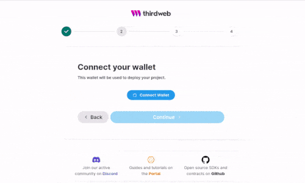

## Build OpenSea Blockchain Web 3.0 App with Next.js | Sanity.io | thirdweb

#### [check the video tutorial here](https://youtu.be/x3eRXeMB-4k)

 

#### Check this other tutorial for more details on this <u>Topic</u>

##### [Build your own NFT marketplace like OpenSea clone with solidity,openzeppelin and polygon (SUBSCRIBE)](https://youtu.be/7Q5E6RvLlUw)

 
 

---

 

### Interesting articles || links: 🐔

##### How to make money with NFT as a developer?

[How to make money with NFT as a developer?](https://youtu.be/5_Wu_X4LnAw)

 

##### NFT Marketplaces

> NFT marketplace rankings and analysis. Find non-fungible token trading volumes, number of traders per NFT marketplace and more key metrics.

[NFT Marketplaces](https://dappradar.com/nft/marketplaces) ✋

 

---

 

# Login:

#### Login in Metamask : [metamask](https://metamask.io/)

#### Login in ThirdWeb : [Thirdweb](https://bit.ly/3EJLftx)

#### Login [Opensea](https://testnets.opensea.io/)

  

---

 
 

 
 

# 

# Metamask

- To **read more** about metamask and thirdweb whole setup, visit the first project I made using: [metamask & and thirdweb](https://github.com/nadiamariduena/crypto-punk-clone-react-web3/tree/1-nft-mining-inting-metamask-setup-fake-eth) 👍

 

##### There you will learn how to connect your metamask with opensea.

 
 

### In this project once again you will have to set up the newtwork to <u>Rinkeby</u>

 

- The **Reason**: ✋

 

> **Ethereum Networks** - The Ethereum Main Network (a.k.a Homestead) is considered to be the production environment. This is where real Ether (ETH) can be exchanged, burned, and mined. Also, there are popular public test networks: Ropsten, Göerli, Kovan, and Rinkeby . All of these networks can be accessed via Infura’s API.

 
 

### Go to settings to start with the setup

 
 

> ##### Once You choose the network, go to the top and click on the SHOW/HIDE, you will then have to scroll down and click on the toggle: TURN/ON like in the gif, after you turned it ON, go up and choose your "Rinkeby" network as it s now available.

 

 
 

## Connect to a Wallet

 

#### Once you choose to connect to metamask, choose the test account you just created.

⚠️ warning It will ask you to continue, but before check that your ETH is in Rinkeby, then choose Rinkeby again

 

- **After that you will have a successful message** and then it will ask you to **create a first project on Rinkeby**

 

 
 

#### Now you are ready to start the project but we dont have ETH 💰 this is important because after you connect the metamask to the thirdweb, you are going to get an error 🔴

 

- To **read more** about metamask and thirdweb whole setup, visit the first project I made using: [metamask & and thirdweb](https://github.com/nadiamariduena/crypto-punk-clone-react-web3/tree/1-nft-mining-inting-metamask-setup-fake-eth) 👍
