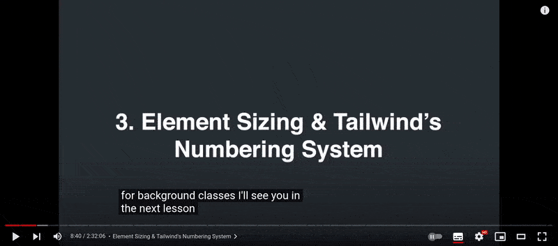
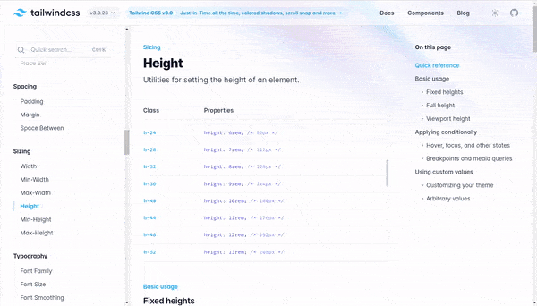
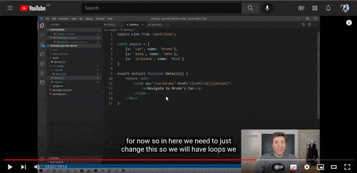

[](https://emoji.gg/emoji/8285-puppycat-pose)

## Build OpenSea Blockchain Web 3.0 App with Next.js | Sanity.io | thirdweb

#### [check the video tutorial here](https://youtu.be/x3eRXeMB-4k)

<br>

#### Check this other tutorial for more details on this <u>Topic</u>

##### [Build your own NFT marketplace like OpenSea clone with solidity,openzeppelin and polygon (SUBSCRIBE)](https://youtu.be/7Q5E6RvLlUw)

<br>

---

<br>

# Docs

> **Blockchain development:** Smart Contracts, security, IDE, Truffle & hardhat, Etherscan, Dapp | **NFT:** ERC's ... [all here](./z_articles.md) ✋

<br>
<br>

## Interesting articles & links:

##### How to make money with NFT as a developer?

[How to make money with NFT as a developer?](https://youtu.be/5_Wu_X4LnAw)

<br>

##### NFT Marketplaces

> NFT marketplace rankings and analysis. Find non-fungible token trading volumes, number of traders per NFT marketplace and more key metrics.

[NFT Marketplaces](https://dappradar.com/nft/marketplaces) ✋

<br>

---

<br>

# Login:

#### Login in Metamask : [metamask](https://metamask.io/)

#### Login in ThirdWeb : [Thirdweb](https://bit.ly/3EJLftx)

#### Login [Opensea](https://testnets.opensea.io/)

 <br>

---

<br>
<br>

## Components

<br>

##### Start by creating the components folder

-Then create the Header.jsx

<br>
<br>

## Tailwind 🌩️

<br>

##### [Tailwind CSS For Absolute Beginners](https://youtu.be/j_5-LISy9Qg)

##### [Tailwind CSS Tutorial for Beginners - Full Course](https://www.youtube.com/watch?v=4wGmylafgM4)

<br>

- Then styled (**we will not take too much time in the styling explanation, just copy and paste it**)

<br>

#### The code below is all our styling

>

<br> But what are these **square** brackets: **bg-[#04111d]**, this is when you want the **exact color or font etc**

```javascript
// Header.js
const style = {
  wrapper: `bg-[#04111d] w-screen px-[1.2rem] py-[0.8rem] flex `,
  logoContainer: `flex items-center cursor-pointer`,
  logoText: ` ml-[0.8rem] text-white font-semibold text-2xl`,
  searchBar: `flex flex-1 mx-[0.8rem] w-max-[520px] items-center bg-[#363840] rounded-[0.8rem] hover:bg-[#4c505c]`,
  //
  //w-full	width: 100% / w-screen	width: 100vw;
  //https://tailwindcss.com/docs/width
  //
  searchIcon: `text-[#8a939b] mx-3 font-bold text-lg`,
  searchInput: `h-[2.6rem] w-full border-0 bg-transparent outline-0 ring-0 px-2 pl-0 text-[#e6e8eb] placeholder:text-[#8a939b]`,
  headerItems: ` flex items-center justify-end`,
  headerItem: `text-white px-4 font-bold text-[#c8cacd] hover:text-white cursor-pointer`,
  headerIcon: `text-[#8a939b] text-3xl font-black px-4 hover:text-white cursor-pointer`,
}
```

<br>

> wrapper: `bg-[#04111d] w-screen px-[1.2rem] py-[0.8rem] flex `,

- this is coming from **tailwind css**

<br>

> The first time I thought this structure I was a bit confused, because if you know how **styled component** looks like, you will say it s similar, but after the teacher pointed out, that **this way is cleaner because with styled components you can get confused** when you dont know what is a real component and what is a div by styled components, and I agree, yes its much better.

<br>

[](https://youtu.be/4wGmylafgM4?t=734)

<br>

[](https://tailwindcss.com/docs/width)

<br>

### But how do we use it?

```javascript
const Header = () => {
  return (
    <div className={style.wrapper}>
      <Link>
        <div className={style.logoContainer}></div>
      </Link>
    </div>
  )
}

export default Header
```

<br>

### Logo 🌵

#### Now lets import the Image logo

<br>

- CReate the assets folder inside the **root** then go to [this link](https://drive.google.com/drive/folders/1BS_tG_B7kH3pJVBu6KJiLgsk4T2gt9Jr) ✋ from the tutorial and download the image to your **assets component**

```javascript
return (
  <div className={style.wrapper}>
    <Link>
      <div className={style.logoContainer}>
        ✋ <Image src={openseaLogo} height={40} width={40} />
      </div>
    </Link>
  </div>
)
```

<br>

### 🔴 At this point you will have an error

```javascript
Unhandled Runtime Error
ReferenceError: Link is not defined
```

#### Solution:

- Import the following:

> import Link from 'next/link'

#### use it like so:

```javascript
<Link href="/">
  <div className={style.logoContainer}>
    <Image src={openseaLogo} height={40} width={40} />
  </div>
</Link>
```

<br>

- 🔴 Dont forget to add this: **href="/"**, as it will also give you an error if you dont add it:

<br>

<br>

# Routing

<br>

> Next.js has a file-system based router built on the concept of pages.

#### 👾 When a file is added to the pages directory, it's automatically available as a route. 👾

The files inside the pages directory can be used to define most common patterns.

[](https://youtu.be/7J4iL1HDshQ?t=826)

<br>

#### If you are new like me with NEXTJS, check this links about 'Routing':

[Routing](https://nextjs.org/docs/routing/introduction)

<br>

#### As you can see in the video below:

> Next. js ships with its own built-in page-based routing system, whereas the typical SPA relies on client-side routing, typically using a library like react-router.

<br>

- Sp as he says it, the pages will become a route, so this is a **filesystem by its route** contrary to **react-router** where you have the switches and things like that, in here it will go by the **Filesystem**, check the min 2:48

##### video [Next.js Tutorial - Part 1 | Router for Beginners](https://youtu.be/7J4iL1HDshQ)

<br>
<br>

### Let's continue

#### Inside the logo container add a text:

```javascript
<Link href="/">
  <div className={style.logoContainer}>
    <Image src={openseaLogo} height={40} width={40} />
  </div>
</Link>
```

<br>

### Searchbar 🌵

#### Now under the <u>Link</u> , add another div

- This div will nest the **searchbar**

- Install react icons but be careful that you are not inside the **studio** folder when you do it:

```javascript
// try it with yarn
yarn add react-icons
// or try it with npm
npm i react-icons
```

<br>

##### You should have something like this:

```javascript
  "dependencies": {
    "next": "latest",
    "react": "^17.0.2",
    "react-dom": "^17.0.2",
    "react-icons": "^4.3.1" ✋
  },

```

<br>
<br>
